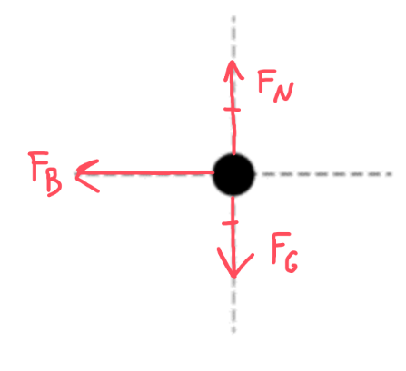

[Scoring Guidelines for Wisusik.EMAG.MR.011]{.underline}

**Highest Possible Score:** 10 Points

a.) 7 Points

i.) 3 Points

  -----------------------------------------------------------------------
  For a multistep derivation beginning with Faraday's Law        1 Point
  -------------------------------------------------------------- --------
  For a correct expression for the induced emf in the bar,       1 Point
  $\varepsilon$ $= Bvw$                                          

  For a power expression equivalent to $P =$                     1 Point
  $\frac{\varepsilon^{2}}{R}$ (correct final answer:             
  $\frac{B^{2}v^{2}w^{2}}{R}$)                                   
  -----------------------------------------------------------------------

*[Example Solution]{.underline}*

$\varepsilon$ $=$ $\frac{d\Phi}{dt}$

$=$ $\frac{d}{dt}$ $(BA)$

$= B$ $\frac{d}{dt}$ $(w \cdot x)$

$= Bw$ $\frac{dx}{dt}$

$\varepsilon$$\  = Bwv$

$P =$ $\frac{\varepsilon^{2}}{R}$ $=$ $\frac{{(Bvw)}^{2}}{R}$

ii.) 2 Points

  -----------------------------------------------------------------------
  For drawing an upwards normal force, and downwards             1 Point
  gravitational force                                            
  -------------------------------------------------------------- --------
  For drawing a leftwards magnetic force                         1 Point

  -----------------------------------------------------------------------

*\*Scoring Note\**

*The relative lengths of arrows/equality markers are not graded*

*[Example Solution]{.underline}*

{width="4.218588145231846in"
height="3.857497812773403in"}

iii.) 2 Points

  -----------------------------------------------------------------------
  For writing a correct statement of Newton's Second Law,        1 Point
  $\sum_{}^{}F = ma$                                             
  -------------------------------------------------------------- --------
  For a differential equation equivalent to $\frac{dv}{dt}$ $=$  1 Point
  $\frac{- B^{2}w^{2}}{mR}$ $v$                                  

  -----------------------------------------------------------------------

*[Example Solution]{.underline}*

$\sum_{}^{}F = ma$

$- F_{B} = m$ $\frac{dv}{dt}$

$- (BIl) = m$ $\frac{dv}{dt}$

$- B$$(\frac{\varepsilon}{R})$ $w$ $= \ m$ $\frac{dv}{dt}$

$- B$$(\frac{(vBw)}{R})$ $w$ $= \ m$ $\frac{dv}{dt}$

$\frac{dv}{dt}$ $=$ $\frac{- B^{2}w^{2}}{mR}$ $v$

b.) 3 Points

  -----------------------------------------------------------------------
  For an expression for $v(t)$ consistent with the differential  1 Point
  equation from the previous part                                
  -------------------------------------------------------------- --------
  For identifying the relationship                               1 Point
  $\Delta x = \int_{}^{}v(t)\ dt$                                

  For correctly evaluating $d = \int_{0}^{\infty}v(t)\ dt$       1 Point
  (correct final answer:                                         
  $d =$$\ \frac{mR{\ v}_{0}}{B^{2}\ w^{2}}$)                     
  -----------------------------------------------------------------------

*[Example Solution]{.underline}*

$\frac{dv}{dt}$ $=$ $\frac{- B^{2}w^{2}}{mR}$ $v$

$v(t) = v_{0}\exp( - \frac{B^{2}w^{2}}{mR}\ t)$

$\Delta x = \int_{}^{}v(t)dt$

$d_{Min} = \int_{0}^{\infty}v(t)dt$

$= \int_{0}^{\infty}$ $v_{0}\exp( - \frac{B^{2}w^{2}}{mR}\ t)\ dt$

$=$ $\frac{- mR{\ v}_{0}}{B^{2}w^{2}}$
$\exp( - \frac{B^{2}w^{2}}{mR}\ t){|_{0}}^{\infty}$

$=$$\ \frac{- mR{\ v}_{0}}{B^{2}w^{2}}$ $(e^{- \infty} - e^{0})$

$=$$\ \frac{- mR{\ v}_{0}}{B^{2}w^{2}}$ $(0 - 1)$

$d_{Min} =$ $\frac{mR{\ v}_{0}}{B^{2}\ w^{2}}$
