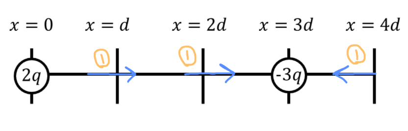
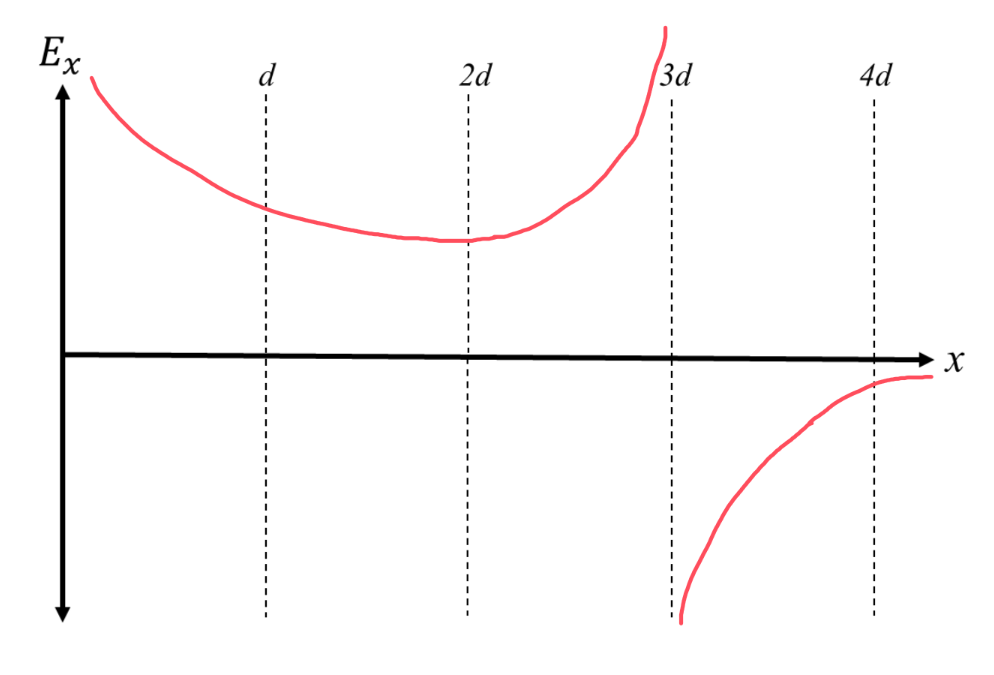

[Scoring Guidelines for Wisusik.EMAG.TBR.002]{.underline}

**Highest Possible Score:** 12 Points

a.) 3 Points

  -----------------------------------------------------------------------
  For drawing a rightward arrow at $x = d$                       1 Point
  -------------------------------------------------------------- --------
  For drawing a rightward arrow at $x = 2d$                      1 Point

  For drawing a leftward arrow at $x = 3d$                       1 Point
  -----------------------------------------------------------------------

*[Example Solution]{.underline}*

{width="6.772579833770779in"
height="2.1815518372703413in"}

b.) 4 Points

+--------------------------------------------------------------+-------+
| For a multistep derivation beginning from $E = \sum_{}^{}$   | 1     |
| $\frac{kq}{r^{2}}$ $\widehat{r}$                             | Point |
+==============================================================+=======+
| For indicating that the net electric field is due to both    | 1     |
| point charges,                                               | Point |
|                                                              |       |
| $\overrightarrow{E                                           |       |
| } = {\overrightarrow{E}}_{2q} + {\overrightarrow{E}}_{- 3q}$ |       |
+--------------------------------------------------------------+-------+
| For an indication that the electric fields are additive at   | 1     |
| $x = d$                                                      | Point |
+--------------------------------------------------------------+-------+
| For a final answer equivalent to $\frac{11\ kq}{4d^{2}}$     | 1     |
|                                                              | Point |
+--------------------------------------------------------------+-------+

*[Example Solution]{.underline}*

$E = \sum_{}^{}$ $\frac{kq}{r^{2}}$ $\widehat{r}$

$\overrightarrow{E} = {\overrightarrow{E}}_{2q} + {\overrightarrow{E}}_{- 3q}$

$=$ $\frac{k(2q)}{{(d)}^{2}}$ $(\widehat{i}) +$
$\frac{k(3q)}{{(2d)}^{2}}$ $(\widehat{i})$

$= ($ $\frac{2kq}{d^{2}}$ $+$ $\frac{3kq}{{4d}^{2}}$ $)\widehat{i}$

$= ($ $\frac{11kq}{{4d}^{2}}$$)\widehat{i}$

$|\overrightarrow{E}| =$ $\frac{11\ kq}{{4\ d}^{2}}$

c.) 3 Points

  -----------------------------------------------------------------------
  For a graph with vertical asymptotes at $x = 0$ and $x = 3d$   1 Point
  -------------------------------------------------------------- --------
  For a graph that is positive when $x < 3d$ and negative when   1 Point
  $x > 3d$                                                       

  For a graph that approaches zero when $x > 3d$                 1 Point
  -----------------------------------------------------------------------

*[Example Solution]{.underline}*

{width="6.87669728783902in"
height="4.672627952755906in"}

d.) 2 Points

  -----------------------------------------------------------------------
  For a claim consistent with the provided representations       1 Point
  -------------------------------------------------------------- --------
  For a valid justification                                      1 Point

  -----------------------------------------------------------------------

*[Example Solution]{.underline}*

*The graph is consistent with the vectors drawn in part (a.)*

*The electric field vectors point to the right at* $x = d$ *and*
$x = 2d$*, while the electric field vector points to the left at*
$x = 4d$*. These directions are consistent with the graph, which is
positive when* $x < 3d$ *and negative when* $x > 3d$
