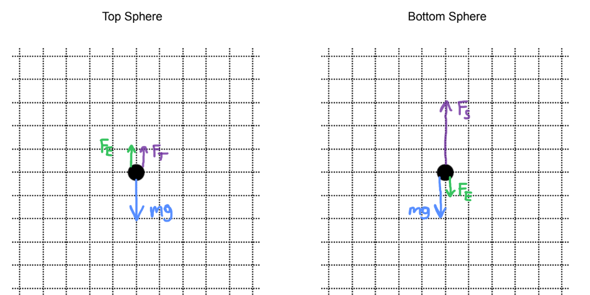
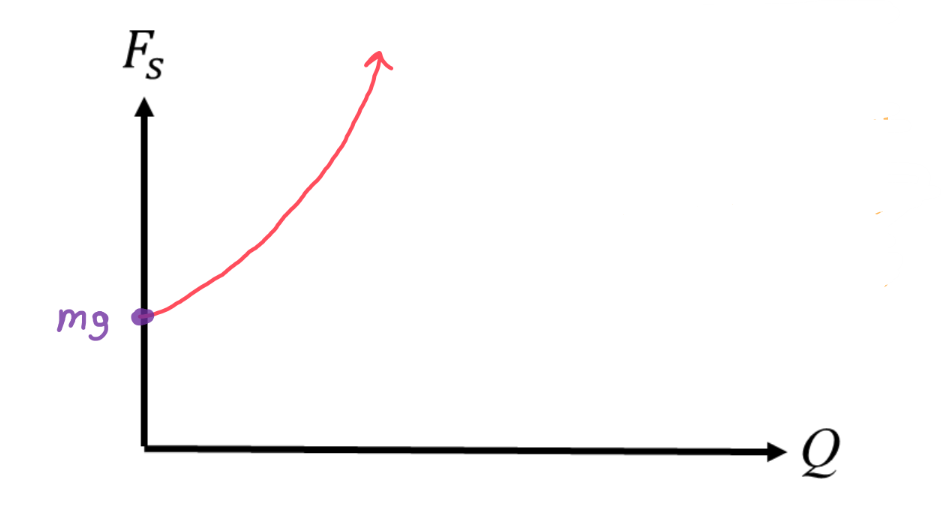

[Scoring Guidelines for Wisusik.EMAG.TBR.003]{.underline}

**Highest Possible Score:** 12 Points

a.) 3 Points

+--------------------------------------------------------------+-------+
| For indicating $F_{Net} = 0$ on *both* spheres               | 1     |
|                                                              | Point |
+==============================================================+=======+
| For showing an equal and opposite electric force on each     | 1     |
| sphere                                                       | Point |
+--------------------------------------------------------------+-------+
| For correct directions of all forces                         | 1     |
|                                                              | Point |
| (Top Sphere: $F_{E}$ Up, $F_{T}$ Up, $F_{g}$ Down)           |       |
|                                                              |       |
| (Bottom Sphere: $F_{s}$ Up, $F_{E}$ Down, $F_{g}$ Down)      |       |
+--------------------------------------------------------------+-------+

*[Example Solution]{.underline}*

{width="7.658940288713911in"
height="3.835094050743657in"}

b.) 4 Points

+--------------------------------------------------------------+-------+
| For a derivation beginning from Newton's or Second Law,      | 1     |
| indicating $F_{Net} = 0$                                     | Point |
+==============================================================+=======+
| For indicating that $F_{s} = F_{E} + F_{g}$ for the bottom   | 1     |
| sphere                                                       | Point |
+--------------------------------------------------------------+-------+
| For correct expressions for each force:                      | 1     |
|                                                              | Point |
| $F_{s} = k_{s}\Delta x$                                      |       |
|                                                              |       |
| $F_{g} = mg$                                                 |       |
|                                                              |       |
| $F_{E} =$ $\frac{kQ^{2}}{D^{2}}$                             |       |
+--------------------------------------------------------------+-------+
| For a correct final answer equivalent to $k_{s} =$           | 1     |
| $\frac{1}{\Delta x}$ $(mg +$ $\frac{kQ^{2}}{D^{2}}$$)$       | Point |
+--------------------------------------------------------------+-------+

*[Example Solution]{.underline}*

$F_{Net} = 0$

$F_{s} = F_{E} + F_{g}$

$k_{s}\Delta x =$ $\frac{kQ^{2}}{D^{2}}$ $+$ $mg$

$k_{s} =$ $\frac{1}{\Delta x}$ $(mg +$ $\frac{kQ^{2}}{D^{2}}$$)$

c.) 3 Points

  -----------------------------------------------------------------------
  For a graph that is strictly increasing                        1 Point
  -------------------------------------------------------------- --------
  For a graph that is concave up                                 1 Point

  For a graph with a labeled y-intercept of *mg*                 1 Point
  -----------------------------------------------------------------------

*[Example Solution]{.underline}*

{width="7.094588801399825in"
height="3.865640857392826in"}

d.) 2 Points

  -----------------------------------------------------------------------
  For indicating the electric force on each sphere will change   1 Point
  direction                                                      
  -------------------------------------------------------------- --------
  For indicating that $F_{T}$ will increase and $F_{s}$ will     1 Point
  decrease                                                       

  -----------------------------------------------------------------------

*[Example Solution]{.underline}*

*\*Scoring Note\**

*No justification is required to earn these points*

*If the sign of one of the spheres is changed, then the electric force
will reverse direction on each sphere (since the force is now
attractive)*

*As a result, the tension force on the top sphere must increase, and the
spring force on the bottom sphere must decrease in order to maintain
equilibrium*
