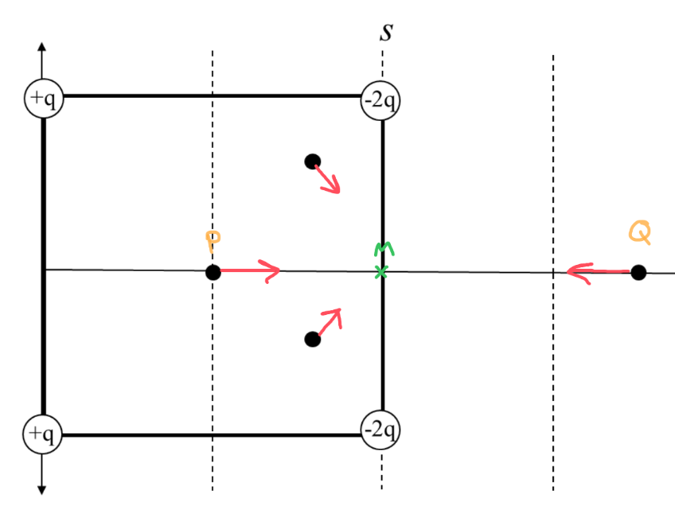
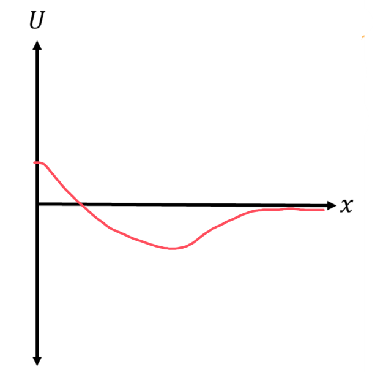

[Scoring Guidelines for Wisusik.EMAG.TBR.004]{.underline}

**Highest Possible Score:** 12 Points

a.) 3 Points

  -----------------------------------------------------------------------
  For drawing a rightward arrow at the dot at the leftmost dot   1 Point
  -------------------------------------------------------------- --------
  For drawing arrows that point towards the squares midpoint at  1 Point
  the remaining two dots within the square                       

  For drawing a leftward arrow at the rightmost dot              1 Point
  -----------------------------------------------------------------------

*[Example Solution]{.underline}*
{width="6.5in"
height="5.013888888888889in"}

b.) 4 Points

+--------------------------------------------------------------+-------+
| For a multistep derivation beginning from the expression for | 1     |
| electric field,                                              | Point |
|                                                              |       |
| $E = \sum_{}^{}$$\ \frac{kq}{r^{2}}$ $\widehat{r}$           |       |
+==============================================================+=======+
| For identifying that the net electric field is the sum of    | 1     |
| the horizontal components of the $- 2q$ charges              | Point |
+--------------------------------------------------------------+-------+
| For correctly identifying the distance to each charge as     | 1     |
| $\frac{s}{2}$                                                | Point |
+--------------------------------------------------------------+-------+
| For a correct final answer equivalent to $E =$ $\frac{8}{}$  | 1     |
| $\frac{kq}{s^{2}}$                                           | Point |
+--------------------------------------------------------------+-------+

*[Example Solution]{.underline}*

$E = \sum_{}^{}$$\ \frac{kq}{r^{2}}$ $\widehat{r}$

${|\ E}_{Net}\ | = 2 \cdot |E_{- 2q,\ x}\ |$

$= 2 \cdot$ $\frac{k(2q)}{r^{2}}$ $\cdot \cos 45{^\circ}$

$= 2 \cdot$ $\frac{k(2q)}{{(\frac{1}{2}\ s)}^{2}}$ $\cdot \frac{1}{}$

${|\ E}_{Net}\ | =$ $\frac{8}{}$ $\frac{kq}{s^{2}}$

c.) 3 Points

  -----------------------------------------------------------------------
  For a graph with a negative minimum value                      1 Point
  -------------------------------------------------------------- --------
  For a graph that approaches zero as $x \rightarrow \infty$     1 Point

  For a graph that remains negative as $x \rightarrow \infty$    1 Point
  -----------------------------------------------------------------------

*[Example Solution]{.underline}*

{width="4.640625546806649in"
height="4.595203412073491in"}

d.) 2 Points

  -----------------------------------------------------------------------
  For selecting $v_{1} > v_{2}$                                  1 Point
  -------------------------------------------------------------- --------
  For a valid justification                                      1 Point

  -----------------------------------------------------------------------

*[Example Solution]{.underline}*

*The net electric force will be directed to the left as the particle
moves to the right, since the charge will be attracted to the square. As
a result, the charge will slow down as it moves, so* $v_{1} > v_{2}$
