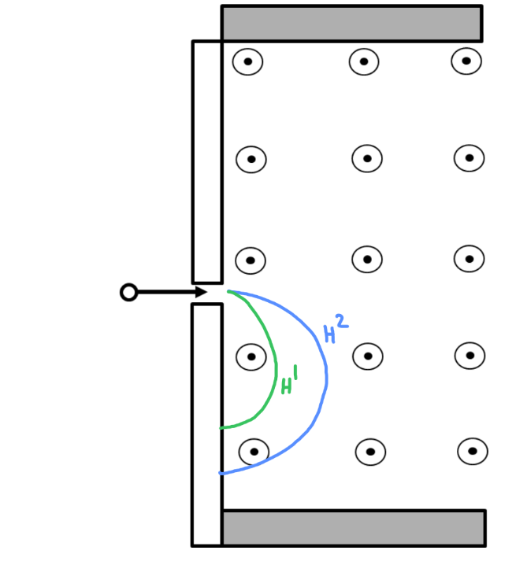
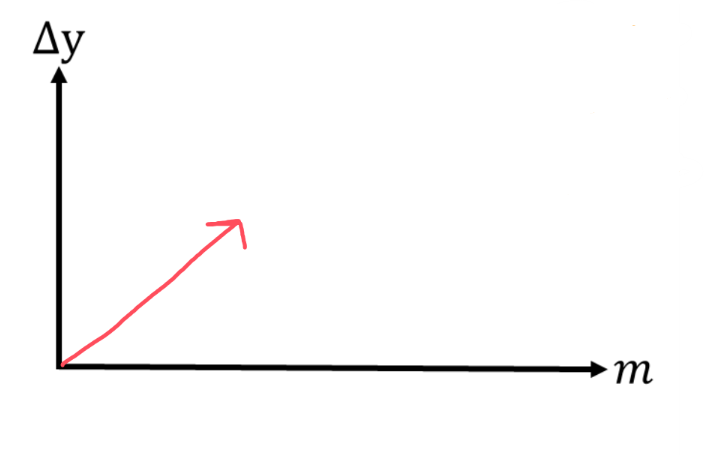

[Scoring Guidelines for Wisusik.EMAG.TBR.008]{.underline}

**Highest Possible Score:** 12 Points

a.) 3 Points

  -----------------------------------------------------------------------
  For drawing two approximately semicircular paths               1 Point
  -------------------------------------------------------------- --------
  For drawing two paths that strike the detector below the entry 1 Point
  point                                                          

  For attaching a label of $H^{2}$ to the path with larger       1 Point
  radius                                                         
  -----------------------------------------------------------------------

*[Example Solution]{.underline}*

{width="4.651042213473316in"
height="5.096866797900263in"}

b.) 4 Points

+--------------------------------------------------------------+-------+
| For a derivation beginning from Newton's Second Law,         | 1     |
| $\sum_{}^{}F = ma$                                           | Point |
+==============================================================+=======+
| For correct expressions for centripetal force                | 1     |
| $\frac{mv^{2}}{R}$ and magnetic force $evB$                  | Point |
+--------------------------------------------------------------+-------+
| For a correct expression for the speed of the ions,          | 1     |
| $v =$$\ \frac{eBR}{m}$                                       | Point |
|                                                              |       |
| *\*Scoring Note\**                                           |       |
|                                                              |       |
| $R = \frac{\ 1}{2}\Delta y_{1}$ *, although this is not      |       |
| relevant to the final answer*                                |       |
+--------------------------------------------------------------+-------+
| For a final answer that solves for the travel time using an  | 1     |
| equation of the form $D = vt$, with $D = \pi\ R$             | Point |
|                                                              |       |
| (Correct Final Answer: $t =$ $\ \frac{m\pi}{eB}$)            |       |
+--------------------------------------------------------------+-------+

*[Example Solution]{.underline}*

$\sum_{}^{}F = ma$

$F_{B} = m$$(\frac{v^{2}}{R})$

$evB =$$\ \frac{mv^{2}}{R}$

$eB =$$\ \frac{mv}{R}$

$v =$$\ \frac{eBR}{m}$

$D = vt$

$\frac{1}{2}(2\pi R) =$ $\ (\frac{eBR}{m})$$\ t$

$t =$ $\ \frac{m\pi}{eB}$

c.) 3 Points

  -----------------------------------------------------------------------
  For a graph that is strictly increasing                        1 Point
  -------------------------------------------------------------- --------
  For a linear graph                                             1 Point

  For a graph that passes through the origin                     1 Point
  -----------------------------------------------------------------------

*[Example Solution]{.underline}*

{width="5.442708880139983in"
height="3.4976377952755904in"}

d.) 2 Points

  -----------------------------------------------------------------------
  For a correct claim about the consistency of the graph and     1 Point
  diagram                                                        
  -------------------------------------------------------------- --------
  For a valid justification                                      1 Point

  -----------------------------------------------------------------------

*[Example Solution]{.underline}*

*The graph shows that as the mass of the particle increases, the radius
of the particle's path also increases. This is consistent with the
diagrams drawn in part (a.), since the more massive* $H^{2}$ *ions take
a path of larger radius as shown in the drawings.*
