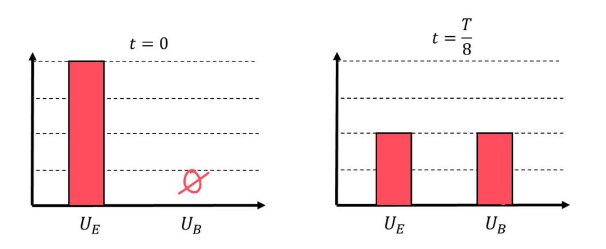
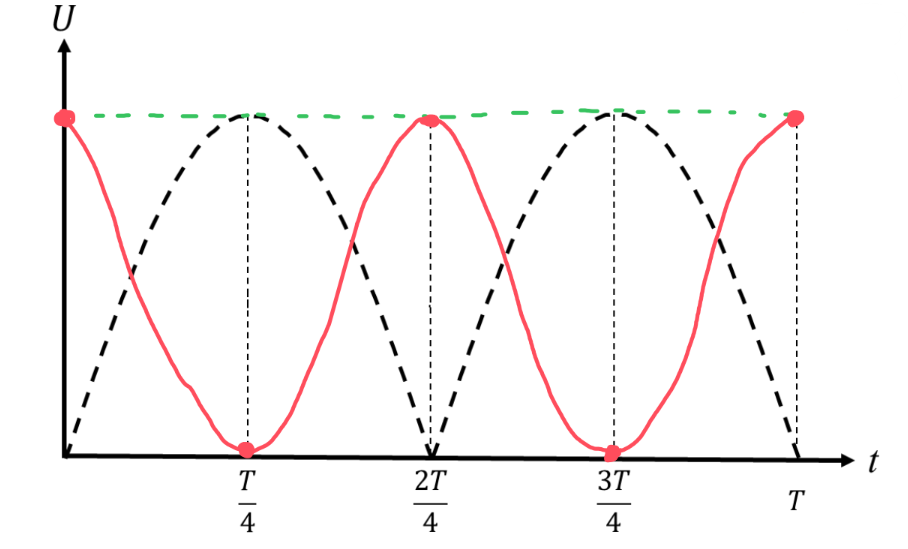

[Scoring Guidelines for Wisusik.EMAG.TBR.009]{.underline}

**Highest Possible Score:** 12 Points

a.) 3 Points

  -----------------------------------------------------------------------
  For indicating $U_{E} \neq 0$, $U_{B} = 0$ at $t = 0$          1 Point
  -------------------------------------------------------------- --------
  For indicating $U_{E} \neq 0$, $U_{B} \neq 0$ at $t = T/8$     1 Point

  For indicating $U_{E} + U_{B} =$ Constant                      1 Point
  -----------------------------------------------------------------------

*[Example Solution]{.underline}*

{width="7.471076115485564in"
height="3.0725207786526685in"}

b.) 4 Points

*[Solution 1]{.underline}*

+--------------------------------------------------------------+-------+
| For a multistep derivation beginning with the expression for | 1     |
| the charge in the circuit as a function of time:             | Point |
| $Q(t) = Q_{0}\cos$$\ (\frac{t}{})$                           |       |
+==============================================================+=======+
| For correctly deriving an expression for $\frac{dI}{dt}$     | 1     |
| $= {- Q}_{0}LC\ \cos$ $\ (\frac{t}{})$                       | Point |
|                                                              |       |
| \*Scoring Note\*                                             |       |
|                                                              |       |
| The negative sign is not required to earn this point         |       |
+--------------------------------------------------------------+-------+
| For correctly computing the the time rate of change of       | 1     |
| current in the inductor at $t = T/8$, $\frac{dI}{dt}$$\  =$  | Point |
| $\frac{Q_{0}}{\ LC}$                                         |       |
+--------------------------------------------------------------+-------+
| For correctly applying the relationship $|\Delta V_{L}| = L$ | 1     |
| $|\frac{dI}{dt}|$                                            | Point |
|                                                              |       |
| Correct Final Answer: $|\ \Delta V_{L}\ |$ $=$               |       |
| $\frac{Q_{0}}{\ C}$                                          |       |
+--------------------------------------------------------------+-------+

*[Example Solution 1]{.underline}*

$Q(t) = Q_{0}\cos$$\ (\frac{t}{})$

$\frac{dI}{dt}$$\  = Q''(t)$ $= {- Q}_{0}LC\ \cos$ $\ (\frac{t}{})$

$\frac{dI}{dt}$$\  = \ $$\frac{dI}{dt}$ ($\frac{\pi\ }{4}$)
$= \  - Q_{0}LC\cos$ $\ (\frac{\pi}{4})$

$\frac{dI}{dt}$$\  =$ $\frac{Q_{0}}{\ LC}$

$|\Delta V_{L}| = L$ $|\frac{dI}{dt}|$ $=$ $\frac{Q_{0}}{\ C}$

*[Solution 2]{.underline}*

+--------------------------------------------------------------+-------+
| For a multistep derivation beginning with Kirchhoff\'s       | 1     |
| Voltage Rule, $\sum_{}^{}\Delta V = 0$                       | Point |
+==============================================================+=======+
| For indicating the magnitude of the potential difference     | 1     |
| across the capacitor and the inductor must be equal          | Point |
+--------------------------------------------------------------+-------+
| For correctly computing the charge on the capacitor at       | 1     |
| $t = T/8$,                                                   | Point |
|                                                              |       |
| $Q =$ $\frac{Q_{0}}{}$                                       |       |
+--------------------------------------------------------------+-------+
| For correctly applying the relationship $\Delta V_{C} =$     | 1     |
| $\frac{Q}{C}$                                                | Point |
|                                                              |       |
| Correct Final Answer:                                        |       |
| $|\ \Delta V_{L}\ | = |\ \Delta V_{C}\ | =$                  |       |
| $\frac{Q_{0}}{\ C}$                                          |       |
+--------------------------------------------------------------+-------+

*[Example Solution 2]{.underline}*

$\sum_{}^{}\Delta V = 0$

$\Delta V_{C} + \Delta V_{L} = 0$

$Q(t) = Q_{0}\cos$$\ (\frac{t}{})$

$Q(T/8) = Q$ ($\frac{\pi\ }{4}$) $= Q_{0}\cos$ $\ (\frac{\pi}{4})$

$Q =$ $\frac{Q_{0}}{}$

$\Delta V_{C} =$ $\frac{Q}{C}$ $=$ $\frac{Q_{0}}{C}$

$\Delta V_{L} = \Delta V_{C} =$ $\frac{Q_{0}}{C}$

c.) 3 Points

  -----------------------------------------------------------------------
  For a graph of $U_{E}$ that is maximized when $t = 0$          1 Point
  -------------------------------------------------------------- --------
  For a graph of $U_{E}$ that has period $\frac{T}{2}$           1 Point

  For a graph of $U_{E}$ satisfying $U_{E} + U_{B} =$ Constant   1 Point
  -----------------------------------------------------------------------

*[Example Solution]{.underline}*

{width="7.064019028871391in"
height="4.2678444881889765in"}

d.) 2 Points

  -----------------------------------------------------------------------
  For one correct change                                         1 Point
  -------------------------------------------------------------- --------
  For a second correct change                                    1 Point

  -----------------------------------------------------------------------

*\*Scoring Note\**

*If more than two changes are listed, deduct one point from this part
for every incorrect statement, for a minimum score of 0/2 on this part*

*[Example Solution]{.underline}*

-   *The graphs of* $U_{E}$ *and* $U_{B}$ *will become taller*

-   *The graphs of* $U_{E}$ *and* $U_{B}$ *will have a shorter period
    (higher frequency)*
