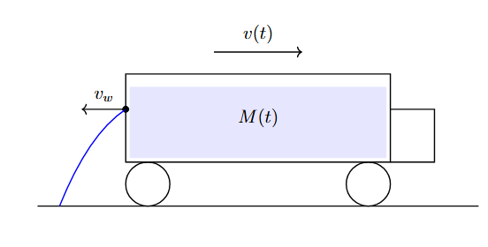
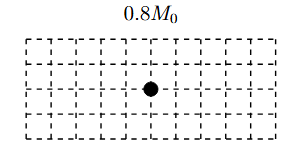
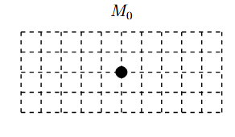

*Suggested Time: 20-25 minutes*

1.) A tanker truck carrying water is moving along a surface with
negligible kinetic friction. The truck has an initial mass $M_{0}$ and
moves at an initial velocity $v_{0}$

-   The truck is then punctured by a small rock, and a leak then forms
    in the tanker truck

-   Water is then ejected from the leak at a constant mass rate
    $\frac{dm}{dt}$ with a horizontal velocity directly opposite to the
    truck's velocity.

-   The height of the water inside the truck does not change
    significantly, such that the water can be modeled as exiting the
    truck at a constant velocity $v_{w} = 2v_{0}$ relative to the truck.

-   The water continues to drain until the truck's mass has decreased to
    its final value of $0.8M_{0}$, when the leak is discovered and
    patched.

{width="6.112053805774278in"
height="3.0934470691163605in"}

a.)

i.) **Derive** an expression for the final velocity $v_{f}$ of the
tanker truck once the mass of the truck has decreased to $0.80M_{0}$.
Answer in terms of $v_{0}$.

ii.) On the diagrams shown below, **draw** a set of arrows to represent
the momentum of the tanker truck at its initial mass $M_{0}$ and final
mass $0.8M_{0}$. Start all arrows from the zero line, and the length of
the arrows should be proportional to the relative magnitudes of the
vectors. Write "Zero" above the dot if the momentum of the truck is
equal to zero at that time.

{width="3.146519028871391in"
height="1.78125in"}{width="3.0729166666666665in"
height="1.7846555118110237in"}

b.) After reaching its destination, the truck stops, and all of the
water in the truck is removed, giving the truck a new mass $m$. The
truck then leaves, and its position increases with time according to the
function $x(t) = bt^{3}$ on the interval $0 \leq t \leq T$. **Derive**
an expression for the average force acting on the truck over this
interval in terms of $m,\ b,$ and $T$.
