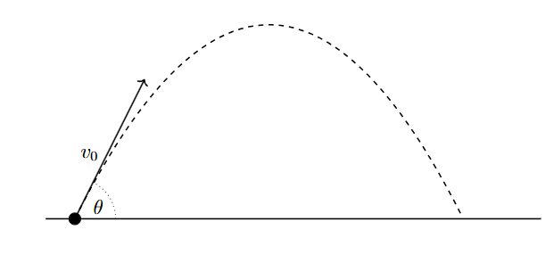

*Suggested Time: 15-20 minutes*

4.) A group of students are experimenting with a virtual simulation
relating to projectile motion. After conducting many trials, one student
makes the following claim:

*"When firing an angled projectile from the ground, doubling the launch
speed results in the horizontal range of the projectile increasing by a
factor of four"*

{width="6.46875in"
height="3.0729166666666665in"}

a.) Without manipulating equations, **justify** the student's claim
using physics principles only.

b.) **Derive** an expression for the horizontal range $R$ of a
projectile fired from the ground in terms of the launch velocity $v_{0}$
and launch angle $\theta$ above the horizontal.

c.) **Indicate** whether your derived expression in part (b.) can be
used to verify the student's claim. Briefly **justify** your answer.
