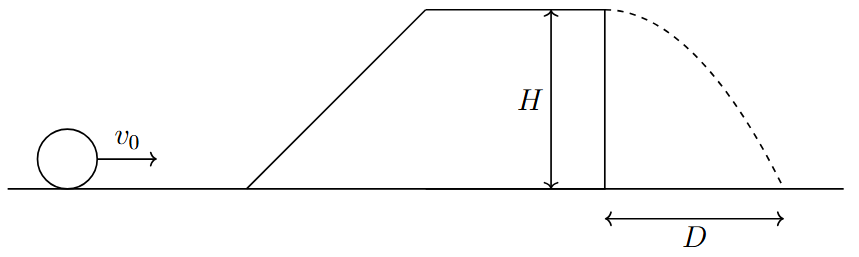

*Suggested Time: 15-20 minutes*

4.) A sphere is launched towards an incline of height $H$. There is
friction between the incline and the sphere, resulting in the sphere
rolling without slipping upon reaching the top of the incline. The
sphere continues to roll without slipping along a frictionless surface
at the top of the incline before falling a distance $H$, striking the
ground a horizontal distance $D$ from the point where the sphere left
the surface.

{width="5.848958880139983in"
height="1.7528127734033245in"}

Suppose two spheres of identical mass and radius are used in the
scenario, given the same launch speed and are not initially rotating
before reaching the incline. One sphere is hollow, while the other
sphere is solid with uniform density.

a.) **Compare** the horizontal distances $D$ traveled by each sphere.

**\_\_\_\_\_\_\_\_\_\_** $D_{Hollow} < D_{Solid}$

**\_\_\_\_\_\_\_\_\_\_** $D_{Hollow} > D_{Solid}$

**\_\_\_\_\_\_\_\_\_\_** $D_{Hollow} = D_{Solid}$

**Justify** your answer without referencing equations.

b.) Suppose a sphere of mass $M$ and radius $R$ has a moment of inertia
given by $I = \beta MR^{2}$. **Derive** an expression for the distance
$D$ in terms of $v_{0},H,$ and $\beta$.

c.) Suppose that instead, both spheres were given the same initial
velocity, and *begin* rolling without slipping with the same
center-of-mass velocity before reaching the incline. **Indicate** how
this affects your comparison of the two distances from part (a.).
Briefly **justify** your answer.
