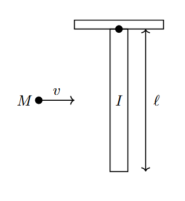
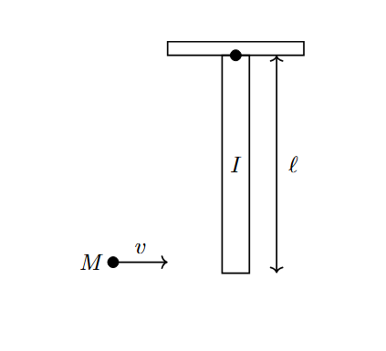

*Suggested Time: 15-20 minutes*

4.) In the scenario shown below, a particle of mass $M$ and horizontal
velocity $v$ strikes the center of a rod of length $l$ pivoted to the
ceiling with moment of inertia $I$ as shown in the figure below. After
colliding with the rod, the particle sticks to the rod and the entire
system rotates with an initial angular speed
$\omega_{0}${width="3.3883366141732285in"
height="3.6869247594050742in"}

Consider the following two possible modifications to the setup:

-   The particle's mass is doubled, which gives the rod an initial
    angular speed of $\omega_{2M}$ after the collision

-   The particle's speed is doubled, which gives the rod an initial
    angular speed of $\omega_{2v}$ after the collision

a.) **Rank** the three angular speeds $\omega_{0}\ ,\ \omega_{2M}\ ,$
and $\omega_{2v}$**. Justify** your ranking without manipulating
equations

b.) **Derive** an expression for $\omega_{0}$ in terms of $M,l,v,$ and
$I$

c.) Suppose that the same three trials are repeated, except the particle
now strikes at the bottom of the rod instead of its center.
{width="3.6927088801399823in"
height="3.363205380577428in"}

**Indicate** how this change will affect your ranking of the three
angular speeds in part (a.). Briefly **justify** your answer by
referencing the equation derived in part (b.)
