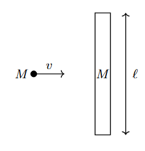
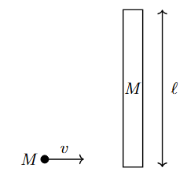

*Suggested Time: 15-20 minutes*

4.) A thin rod of mass $M$ and length $l$ is floating at rest in empty
space and is free to rotate. A sticky clay ball of mass $M$ is moving at
a velocity $v$ perpendicular to the rod. Consider the following two
positions at which the ball could strike the rod:

**Case 1:**

*The ball strikes the rod at its
center*{width="2.1718755468066493in"
height="2.25704615048119in"}

**Case 2:**

*The ball strikes the rod at one of its ends*

{width="2.129213692038495in"
height="2.035622265966754in"}

a.) Suppose the clay ball sticks to the rod in both cases. **Compare**
the total kinetic energy of the rod-ball system after each collision:

\_\_\_\_\_ $\ \ \ \ \ \ K_{Case\ 1} > K_{Case\ 2}$

\_\_\_\_\_\_ ${\ \ \ \ \ K}_{Case\ 1} < K_{Case\ 2}$

\_\_\_\_\_\_ ${\ \ \ \ \ K}_{Case\ 1} = K_{Case\ 2}$

**Justify** your choice without referencing equations

b.) Suppose the rotational inertia of the ball-rod system about its
center of mass is given by $I = \beta\ Ml^{2}$ in Case 2, where $\beta$
is a unitless constant. **Derive** an expression for the total kinetic
energy of the rod-ball system after the collision in Case 2 in terms of
$M$, $v_{0}$, and $\beta$.

c.) **Indicate** whether the collision in Case 2 is elastic, given that
$\beta =$ $\frac{5}{24}$. **Justify** your answer using your derived
expression from part (b.).
