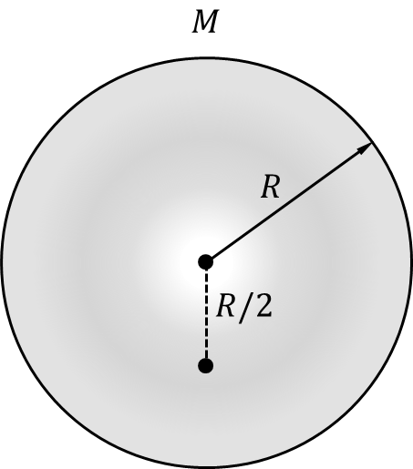

*Suggested Time: 15-20 minutes*

4.) Planet X is spherical in shape and has a non-uniform volumetric mass
density that varies as a function of the radial distance $r$ from the
planet's center. More specifically, $\rho(r) =$ $\frac{M}{\pi R^{4}}$
$r$ inside the planet, where $M$ and $R$ represent the total mass and
radius of Planet X, respectively.

{width="2.1006233595800525in"
height="2.3055555555555554in"}

a.) How does the value the gravitational field strength $g_{R}$ at the
surface of Planet X compare to the value of the gravitational field
strength $g_{R/2}$ a distance $R/2$ from the center of Planet X?

> \_\_\_\_\_\_\_\_\_\_\_\_\_\_\_ $g_{R}\  < 2{\ g}_{R/2}\ \ $
>
> \_\_\_\_\_\_\_\_\_\_\_\_\_\_\_ $g_{R}\  = 2{\ g}_{R/2}\ \ $
>
> \_\_\_\_\_\_\_\_\_\_\_\_\_\_\_ $g_{R}\  > 2{\ g}_{R/2}\ \ $

**Justify** your answer without manipulating equations

b.) **Derive** an expression for $g_{R/2}$ in terms of the $M,R,$ and
physical constants.

c.) **Indicate** one modification to the mass distribution of Planet X
that would change your selection from part (a.). **Justify** why this
modification would change your selection.
