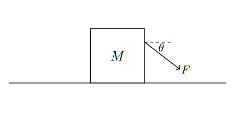

*Suggested Time: 25-30 minutes*

2.) A block of mass $M$ is being pulled to the right along a horizontal
at constant speed by a force $F$ oriented at an angle $\theta$ below the
horizontal, as shown below. The coefficient of kinetic friction between
the block and the ground is
$\mu$.{width="5.508685476815398in"
height="2.6688035870516185in"}

a.) On the dot below, **draw** and **label** the forces (not components)
that act on the block when it is moving across the horizontal surface at
constant speed. The relative lengths of the arrows should reflect the
relative magnitudes of the forces.

{width="3.3593755468066493in"
height="3.3593755468066493in"}

b.) **Derive** an expression for $F$, the amount of force required to
pull the block at constant speed in terms of $M,\theta,\mu$ and physical
constants. Begin your derivation by writing a fundamental physics
principle or an equation from the reference tables.

c.) Let $\mu = 1$. On the graph below, **sketch** a plot of the required
force $F$ as a function of $\theta$ on the interval
$0 \leq \theta < 90{^\circ}$, given that the graph has a vertical
asymptote at $\theta = 45$°. **Label** the vertical intercept of the
graph with its corresponding value. If the graph does not exist in a
specific region, do not draw anything in that region.

{width="6.036132983377078in"
height="3.659267279090114in"}

d.) **Indicate** whether the vertical asymptote at $\theta = 45$° is
consistent with your expression derived in part (b.) in the case
$\mu = 1$. Briefly **justify** your answer.
