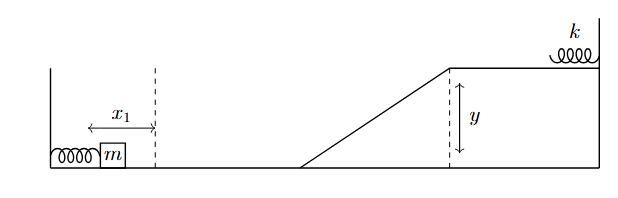
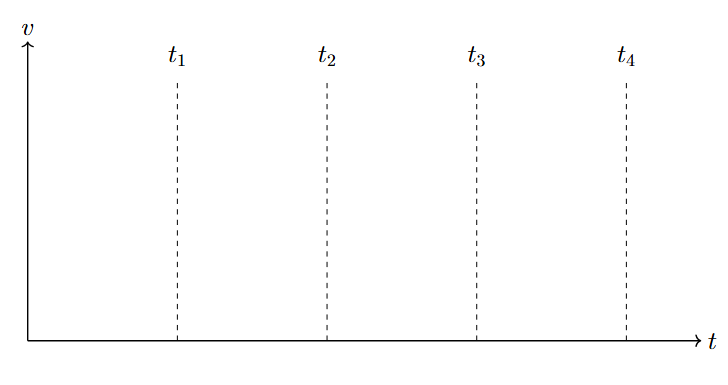

*Suggested Time: 25-30 minutes*

2.) A block of mass $m$ is placed against a spring with a nonlinear
restoring force with magnitude given by $F(x) = 3x^{2}$, where $x$ is
the spring's displacement from equilibrium. An external force holds the
block against the spring, and compresses the spring a distance $x_{1}$.
The block is then released from rest and detaches from the spring upon
passing through the spring's equilibrium position. The block then
travels up an incline of height $y$ before compressing an ideal spring
with force constant $k$ a distance $x_{2}$. Assume friction is
negligible between all surfaces.

{width="6.9799168853893265in"
height="2.2403444881889762in"}

a.) Consider the period of time when the block is released from rest,
and still attached to the spring. On the dots below, **draw** and
**label** the forces (not components) that act on the block when the
spring is compressed each of the following distances. The relative
lengths of the arrows should reflect the relative magnitudes of the
forces.

> $\Delta x = x_{1}$ $\Delta x = {0.5\ x}_{1}$
> {width="2.1584251968503936in"
> height="2.1584251968503936in"}{width="2.15625in"
> height="2.15625in"}

b.) **Derive** an expression for $x_{2}$, the maximum compression of the
ideal spring. Answer in terms of the given quantities and physical
constants.

c.) Consider the following times:

-   At $t = 0$, the block is released from rest

-   At time $t = t_{1}$, the spring reaches its equilibrium position,
    and the block leaves the spring

-   At time $t = t_{2}$, the block reaches the bottom of the incline

-   At time $t = t_{3}$, the block reaches the top of the incline

-   At time $t = t_{4}$ the ideal spring is fully compressed for the
    first time

On the axes below, **sketch** a graph of the block's velocity versus
time on the interval
$0 \leq t \leq t_{4}${width="6.0625in"
height="3.2108792650918634in"}

d.) **Indicate** whether your graph drawn in part (c.) is consistent
with your force diagrams drawn in part (a.). Briefly **justify** your
answer.
