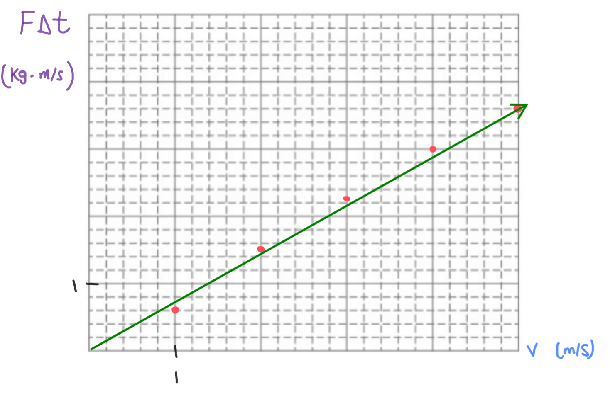

[Scoring Guidelines for Wisusik.MECH.LAB.003]{.underline}

**Highest Possible Score:** 10 Points

a.) 2 Points

  -----------------------------------------------------------------------
  For indicating that the velocity of *both* carts should be     1 Point
  measured before and after the carts collide                    
  -------------------------------------------------------------- --------
  For indicating that data from multiple collisions should be    1 Point
  recorded                                                       

  -----------------------------------------------------------------------

*[Example Solution]{.underline}*

-   *Turn on the motion sensors attached to each cart*

-   *Send one of the carts towards the other cart, which will be
    initially at rest*

-   *Once the carts collide, record the velocity of each cart
    immediately before and*

> *after the collision*

-   *Collect data for a variety of collisions with different speeds and
    initial conditions*

b.) 2 Points

  -----------------------------------------------------------------------
  For indicating how to use the collected data to calculate the  1 Point
  momentum of each cart before and after the collision           
  -------------------------------------------------------------- --------
  For indicating what overall results would imply whether the    1 Point
  total momentum of the system is conserved                      

  -----------------------------------------------------------------------

*[Example Solution]{.underline}*

-   *Calculate the total momentum of the system before the collision by
    adding together the values of mass \* velocity for each cart before
    the collision occurs*

-   *Calculate the total momentum of the system after the collision by
    adding together the values of mass \* velocity for each cart before
    the collision occurs*

-   *Calculate the change in momentum for each trial, and find the
    average change in momentum of for the system over all trials*

-   *If the net change in momentum is close to zero, then we can say
    that the system's momentum is conserved during the collisions*

c.) 4 Points

i.) 1 Point

+--------------------------------------------------------------+-------+
| For a correct choice of quantities that could be graphed to  | 1     |
| yield a straight line                                        | Point |
|                                                              |       |
| with the same functional dependence as                       |       |
| $F\Delta t\ \ vs\ \ v$                                       |       |
+==============================================================+=======+
+--------------------------------------------------------------+-------+

*[Example Solution]{.underline}*

$\Delta p = F\Delta t$

$m\Delta v = F\Delta t$

$\lbrack F\Delta t\rbrack = (m)\lbrack\Delta v\rbrack$

ii.) 3 Points

  -----------------------------------------------------------------------
  For using a set of properly labeled axes (with a scale +       1 Point
  units), and using at least half of the available grid space    
  -------------------------------------------------------------- --------
  For correctly transforming and plotting the data using the     1 Point
  quantities indicated in part (i.)                              

  For drawing a best fit line that approximates the data         1 Point
  -----------------------------------------------------------------------

*[Example Solution]{.underline}*

{width="7.731601049868766in"
height="5.0552777777777775in"}

d.) 2 Points

+--------------------------------------------------------------+-------+
| For correctly relating the slope of the line to the mass of  | 1     |
| the cart                                                     | Point |
+==============================================================+=======+
| For a final answer consistent with the slope of the line     | 1     |
| graphed and identified relationship                          | Point |
|                                                              |       |
| (Correct Final Answer: $m \approx 0.75\ kg\ $)               |       |
+--------------------------------------------------------------+-------+

*[Example Solution]{.underline}*

$\lbrack F\Delta t\rbrack = (m)*\lbrack v\rbrack$

Linear Regression: $y = (.746)x - (0.034)$

$Slope = m$

$m = 0.746\ kg$
