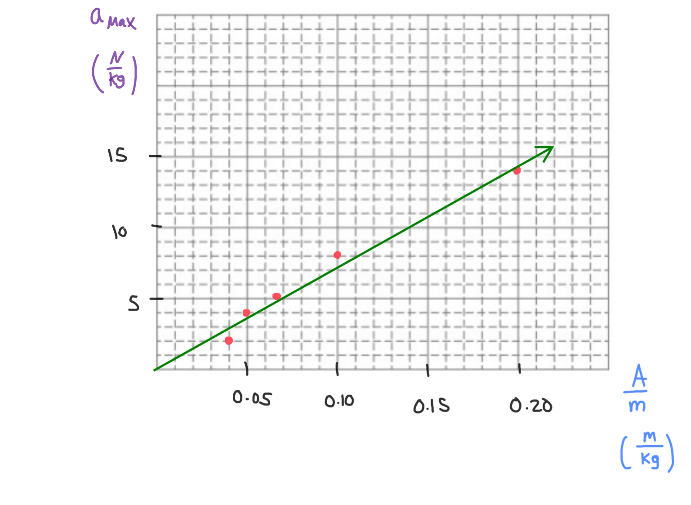

[Scoring Guidelines for Wisusik.MECH.LAB.005]{.underline}

**Highest Possible Score:** 10 Points

a.) 2 Points

  -----------------------------------------------------------------------
  For describing a valid method for determining the period of    1 Point
  the pendulum                                                   
  -------------------------------------------------------------- --------
  For indicating the period should be measured for a variety of  1 Point
  string lengths                                                 

  -----------------------------------------------------------------------

*[Example Solution]{.underline}*

-   *Measure the length* $L$ *of the yo-yo string, and find the period*
    $T$ *by using a stopwatch to time how long it takes for the pendulum
    to complete one oscillation*

-   *Repeat the experiment after extending the yo-yo string to various
    lengths* $L$ *in order to obtain data relating* $L$ *and* $T$

b.) 2 Points

  -----------------------------------------------------------------------
  For a valid graph that could be used to determine if $T$ is    1 Point
  proportional to $L$                                            
  -------------------------------------------------------------- --------
  For a valid analysis of the graph                              1 Point

  -----------------------------------------------------------------------

*[Example Solution]{.underline}*

-   *Graph* $T$ *versus* $L$

-   *If the graph of* $T$ *versus* $L$ *is approximately linear, then
    the students' claim of period being proportional to length would be
    correct*

c.) 4 Points

i.) 1 Point

+--------------------------------------------------------------+-------+
| For a correct choice of quantities that could be graphed to  | 1     |
| yield a straight line                                        | Point |
|                                                              |       |
| with the same functional dependence as $a\ \ vs\ $           |       |
| $\frac{1}{m}$                                                |       |
+==============================================================+=======+
+--------------------------------------------------------------+-------+

*[Example Solution]{.underline}*

$a = \omega^{2}x$

$a_{Max} = \omega^{2}{\Delta x}_{Max}$

$a_{Max} = \omega^{2}A$

$a_{Max} =$ $\frac{k}{m}$ $A$

$\lbrack a_{Max}\rbrack =$ $(k)$ $\lbrack\frac{A}{m}\rbrack$

ii.) 3 Points

  -----------------------------------------------------------------------
  For using a set of properly labeled axes (with a scale +       1 Point
  units), and using at least half of the available grid space    
  -------------------------------------------------------------- --------
  For correctly transforming and plotting the data using the     1 Point
  quantities indicated in part (i.)                              

  For drawing a best fit line that approximates the data         1 Point
  -----------------------------------------------------------------------

*[Example Solution]{.underline}*

{width="8.380208880139982in"
height="6.123561898512686in"}

d.) 2 Points

+--------------------------------------------------------------+-------+
| For correctly relating the slope of the line to the spring   | 1     |
| constant $k$                                                 | Point |
+==============================================================+=======+
| For a final answer consistent with the slope of the line     | 1     |
| graphed and identified relationship                          | Point |
|                                                              |       |
| (Correct Final Answer: $k \approx 70\ N/m\ $)                |       |
+--------------------------------------------------------------+-------+

*[Example Solution]{.underline}*

$\lbrack a_{Max}\rbrack =$ $(k)$ $\lbrack\frac{A}{m}\rbrack$

Linear Regression: $y = (71.2)x + (0.09)$

$Slope = k$

$k =$ $71.2$ $\frac{N/kg}{m/kg}$

$k =$ $71.2$ $\frac{N}{m}$

$$$$
