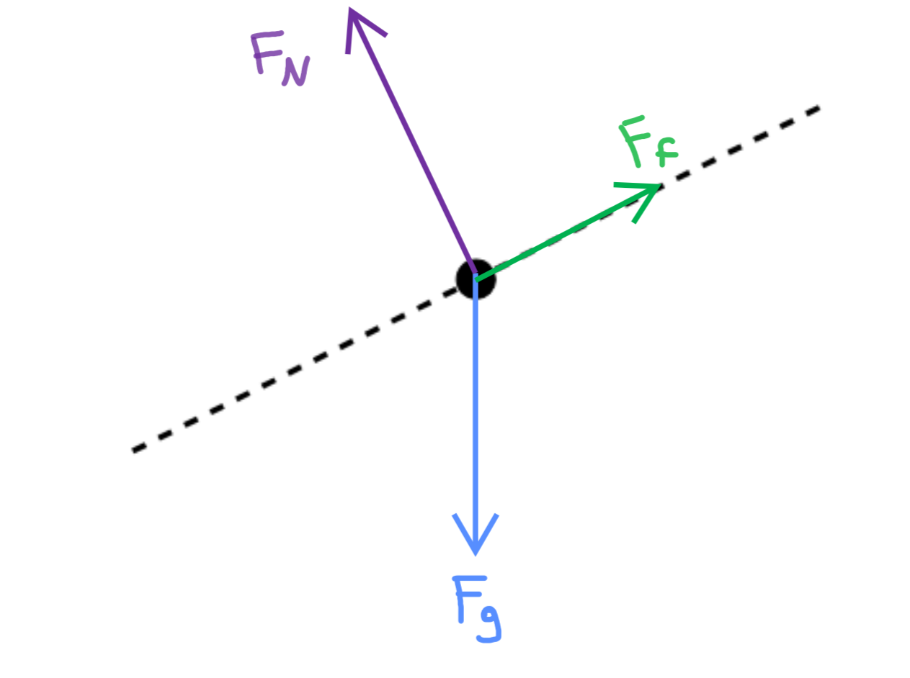

[Scoring Guidelines for Wisusik.MECH.MR.001]{.underline}

**Highest Possible Score:** 10 Points

a.) 7 Points

i.) 2 Point

+--------------------------------------------------------------+-------+
| For drawing and labeling the (downwards) gravitational force | 1     |
| and (out of the ramp)                                        | Point |
|                                                              |       |
| normal force                                                 |       |
+==============================================================+=======+
| For drawing and labeling the frictional force (up the        | 1     |
| incline) and no extraneous forces                            | Point |
+--------------------------------------------------------------+-------+

*[Example Solution]{.underline}*

{width="5.6121062992125985in"
height="4.1820986439195105in"}

ii.) 5 Points

+--------------------------------------------------------------+-------+
| For a multistep derivation using Newton's Second Law         | 1     |
|                                                              | Point |
+==============================================================+=======+
| For a correct net force equation for *both* hanging blocks   | 1     |
|                                                              | Point |
| (or an indication that the net external force on both blocks |       |
| is $3Mg$)                                                    |       |
+--------------------------------------------------------------+-------+
| For a correct net force equation for the block on the        | 1     |
| incline                                                      | Point |
|                                                              |       |
| (or an indication that the net external force on the block   |       |
| is $7Mg(\sin\theta - \mu\cos\theta)$)                        |       |
+--------------------------------------------------------------+-------+
| For a correct acceleration of the system, $a =$              | 1     |
| $\frac{7\ (\sin\theta - \mu\cos\theta)\  - 3}{10}$ $g$       | Point |
+--------------------------------------------------------------+-------+
| For a consistent substitution into a net force equation that | 1     |
| solves for $F_{T}$                                           | Point |
|                                                              |       |
| (Correct Final Answer: $F_{T} =$                             |       |
| $\frac{7\ (\sin\theta - \mu\cos\theta)\  + 17}{5}$ $Mg$      |       |
+--------------------------------------------------------------+-------+

*\*Scoring Note\**

*A "net force on the system" approach is sufficient to earn both of the
points relating to writing net force equations*

*[Example Solution]{.underline}*

$F_{Net,\ 2M} = F_{T} - 2Mg$

$F_{Net,\ M} = T_{2} - F_{T} - Mg$

$F_{Net,7M} = 7Mg\sin\theta - 7\mu Mg\cos\theta - T_{2}$

*-Combine the net force equations via addition:*

$2Ma = F_{T} - 2Mg$

$Ma = T_{2} - F_{T} - Mg$

$7Ma = 7Mg\sin\theta - 7\mu Mg\cos\theta - T_{2}$

+\_\_\_\_\_\_\_\_\_\_\_\_\_\_\_\_\_\_\_\_\_\_\_\_\_\_\_\_\_\_\_\_

$(10M)a = 7Mg\sin\theta - 7\mu Mg\cos\theta - 3Mg$

$a =$ $\frac{7\ (\sin\theta - \mu\cos\theta)\  - 3}{10}$ $g$

$2Ma = F_{T} - 2Mg$

$F_{T} = 2M(a + g)$

$=$ $2M($$\frac{7\ (\sin\theta - \mu\cos\theta)\  - 3}{10}$ $+ 2)g$

$=$ $2M($$\frac{7\ (\sin\theta - \mu\cos\theta)\  + 17}{10}$$)g$

$F_{T} = ($$\frac{7\ (\sin\theta - \mu\cos\theta)\  + 17}{5}$$)Mg$

b.) 3 Points

+--------------------------------------------------------------+-------+
| For a multi step derivation beginning from Newton's Second   | 1     |
| Law                                                          | Point |
+==============================================================+=======+
| For indicating the acceleration of the connected system is   | 1     |
| $\frac{F}{10M}$                                              | Point |
+--------------------------------------------------------------+-------+
| For a final answer consistent with previous work and         | 1     |
| $F_{Net} = \mu Mg$,                                          | Point |
|                                                              |       |
| (Correct Final Answer: $F_{Max} = 10\mu Mg$)                 |       |
+--------------------------------------------------------------+-------+

*[Example Solution]{.underline}*

$F_{Net,System} = F_{Max}$

$M_{Tot}a_{Max} = F_{Max}$

$(10M)a_{Max} = F_{Max}$

$a =$ $\frac{F_{Max}}{10M}$

$F_{Net,\ Top\ Block} = f_{s,\ Max}$

$Ma = \mu Mg$

$M$ $(\frac{F_{Max}}{10M})$$= \mu Mg$

$F_{Max} = 10\mu Mg$
