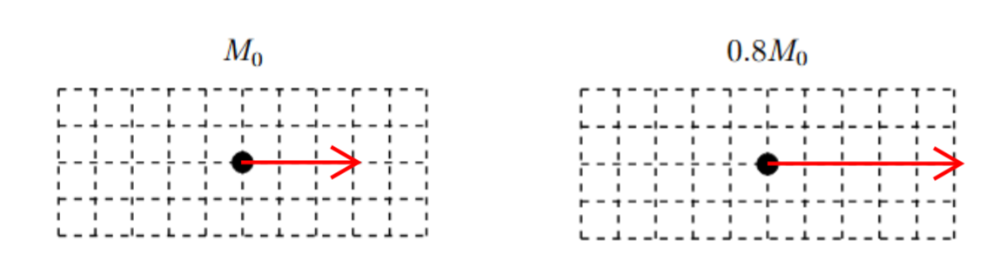

[Scoring Guidelines for Wisusik.MECH.MR.003]{.underline}

**Highest Possible Score:** 10 Points

a.) 7 Points

i.) 5 Points

+--------------------------------------------------------------+-------+
| For a multistep derivation beginning with Newton's Second    | 1     |
| Law $F_{Net} = ma$                                           | Point |
+==============================================================+=======+
| For indicating ${|F}_{Net}| =$ $- 2v_{0}$ $\frac{dm}{dt}$    | 1     |
|                                                              | Point |
+--------------------------------------------------------------+-------+
| For writing Newton's Second Law as a differential equation,  | 1     |
| $m$ $\frac{dv}{dt}$ $=$ $- 2v_{0}$ $\frac{dm}{dt}$           | Point |
+--------------------------------------------------------------+-------+
| For attempting to integrate both sides of the equation,      | 1     |
| using appropriate limits                                     | Point |
+--------------------------------------------------------------+-------+
| For a correct final answer,                                  | 1     |
|                                                              | Point |
| $v_{f} = (1 - 2\ln(0.8)){\ v}_{0}$                           |       |
|                                                              |       |
| or $v_{f} \approx 1.45v_{0}$                                 |       |
+--------------------------------------------------------------+-------+

*[Example Solution]{.underline}*

$F_{Net} = ma$

$F_{Net} = F_{Thrust} =$ $\frac{dp_{Water}}{dt}$

$F_{Thrust} = \ $$\frac{d}{dt}$ $(m_{Water}v_{Water})$

$=$ $- v_{water}$ $\frac{dm}{dt}$

$F_{Thrust} = \ $$- 2v_{0}$ $\frac{dm}{dt}$

$m$ $\frac{dv}{dt}$ $= \ $$- 2v_{0}$ $\frac{dm}{dt}$

$m\ dv$ $= \ $$- 2v_{0}\ dm$

$dv = \  - 2v_{0}$$\frac{dm}{m}$ $$

$\int_{v_{0}}^{v_{f}}\ $$dv = \  - 2v_{0}\int_{M_{0}}^{0.8M_{0}}$$\frac{dm}{m}$
$$

$v_{f} - v_{0} = \  - 2v_{0}\lbrack\ln(0.8\ M_{0}) - \ln(M_{0})\rbrack$

$v_{f} = v_{0} - 2v_{0}\ln(0.8)$

$v_{f} = (1 - 2\ln(0.8))v_{0}$

$v_{f} \approx 1.45{\ v}_{0}$

ii.) 2 Points

  -----------------------------------------------------------------------
  For drawing a rightward arrow for both masses                  1 Point
  -------------------------------------------------------------- --------
  For drawing an arrow of greater magnitude at $0.8{\ M}_{0}$    1 Point

  -----------------------------------------------------------------------

*[Example Solution]{.underline}*
{width="7.650495406824147in"
height="1.9494050743657043in"}

b.) 3 Points

[Solution 1]{.underline}

+--------------------------------------------------------------+-------+
| For a multistep derivation involving the Impulse Momentum    | 1     |
| Theorem, $m\Delta v = F_{avg}T$                              | Point |
+==============================================================+=======+
| For correctly finding the velocity as a function of time,    | 1     |
| $v(t) = 3bt^{2}$                                             | Point |
+--------------------------------------------------------------+-------+
| For a final answer consistent with previous results and      | 1     |
| $\Delta v = v(T)$                                            | Point |
|                                                              |       |
| (Correct final answer: $F_{avg} = 3mbT\ $)                   |       |
+--------------------------------------------------------------+-------+

*[Example Solution 1]{.underline}*

$m\Delta v = \int_{}^{}F(t)dt$

$m\Delta v = F_{avg}\ \Delta t\ $

$v(t) =$ $\frac{dx}{dt}$ $=$ $\frac{d}{dt}$ $(bt^{3}) = 3bt^{2}$

$m(v(T) - v(0)) = F_{avg}T$

$m(3bT^{2} - 0) = F_{avg}T$

$F_{avg} = 3mbT$

[Solution 2]{.underline}

+--------------------------------------------------------------+-------+
| For a multistep derivation involving Newton's Second Law,    | 1     |
| $F = ma$                                                     | Point |
+==============================================================+=======+
| For correctly finding the velocity as a function of time,    | 1     |
| $v(t) = 3bt^{2}$                                             | Point |
+--------------------------------------------------------------+-------+
| For correctly finding and substituting the average           | 1     |
| acceleration into Newton's Second Law using $a_{avg} =$      | Point |
| $\frac{\Delta v}{\Delta t}$                                  |       |
|                                                              |       |
| (Correct final answer: $F_{avg} = 3mbT\ $)                   |       |
+--------------------------------------------------------------+-------+

*[Example Solution 1]{.underline}*

$F_{avg} = ma_{avg}$

$v(t) =$ $\frac{dx}{dt}$ $=$ $\frac{d}{dt}$ $(bt^{3}) = 3bt^{2}$

$a_{avg} =$ $\frac{\Delta v}{\Delta t}$ $=$ $\frac{3bT^{2}}{T}$

$a_{avg} = \ 3bT$

$F_{avg} = ma_{avg}$

$F_{avg} = 3mbT$
