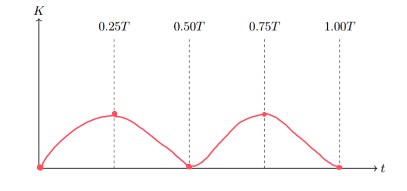

[Scoring Guidelines for Wisusik.MECH.MR.005]{.underline}

**Highest Possible Score:** 10 Points

a.) 7 Points

i.) 2 Points

  -----------------------------------------------------------------------
  For drawing a continuous curve with period $\frac{T}{2}$       1 Point
  -------------------------------------------------------------- --------
  For drawing a curve that is minimized at $t = 0$, and          1 Point
  maximized at $t =$ $\frac{T}{4}$                               

  -----------------------------------------------------------------------

*[Example Solution]{.underline}*

{width="7.956305774278215in"
height="3.735893482064742in"}

ii.) 3 Points

+--------------------------------------------------------------+-------+
| For a multistep derivation involving the relationship        | 1     |
| $T = 2\pi$ $$                                                | Point |
+==============================================================+=======+
| For correctly indicating that the effective spring constant  | 1     |
| is equal to $2k$                                             | Point |
+--------------------------------------------------------------+-------+
| For a final answer indicating the time required is one       | 1     |
| quarter cycle, $t =$ $\frac{T}{4}$                           | Point |
|                                                              |       |
| (Correct Final Answer: $t =$ $\frac{\pi}{2}$$$)              |       |
+--------------------------------------------------------------+-------+

*[Example Solution]{.underline}*

$T = 2\pi$ $$

$k_{eq} = \ ($$\frac{1}{3k + 3k}$ $+$ $\frac{1}{3k}$ $)^{- 1}$

$= \ 2k$

*Velocity will be maximized after one quarter cycle*

$t =$ $\frac{T}{4}$

$t =$ $\frac{\pi}{2}$$$

iii.) 2 Points

  -----------------------------------------------------------------------
  For stating $\frac{T_{2k}}{T}$ $=$ $\frac{1}{}$                1 Point
  -------------------------------------------------------------- --------
  For a valid justification or correct supporting work           1 Point

  -----------------------------------------------------------------------

*[Example Solution]{.underline}*

-   *Since the period is proportional to* $$*, doubling the value of*
    $k$ *will cause the denominator to increase by a factor* $$

-   *Since the period decreases by a factor of* $$*, we can evaluate*
    $\frac{T_{2k}}{T}$ $=$ $\frac{1}{}$

b.) 3 Points

+--------------------------------------------------------------+-------+
| For a derivation that uses the rotational form of Newton's   | 1     |
| Second Law, $\tau = I\alpha$                                 | Point |
+==============================================================+=======+
| For correctly computing the magnitude of the torque          | 1     |
| contributions from both masses ($3MgL\sin\theta$), and       | Point |
| accounting for the rotational inertia of the block           |       |
| ($ML^{2}$)                                                   |       |
+--------------------------------------------------------------+-------+
| For a consistent final answer written in the form of a       | 1     |
| differential equation that shows $\alpha$ is proportional to | Point |
| negative $\sin\theta$                                        |       |
|                                                              |       |
| (Correct Final Answer: $- 3MgL\sin\theta$                    |       |
| $= (I_{Rod} + ML^{2})$ $\frac{d^{2}\theta}{dt^{2}}$)         |       |
+--------------------------------------------------------------+-------+

*[Example Solution]{.underline}*

$\sum_{}^{}\tau = I\alpha$

$\tau_{g,Rod} + \tau_{g,Block} = I_{System}\alpha$

$( - 4Mg)($$\frac{L}{2}$
$\sin\theta) +$$( - Mg)($$L\sin\theta) = (I_{Rod} + ML^{2})\alpha$

$- 3MgL\sin\theta$ $= (I_{Rod} + ML^{2})\alpha$

$- 3MgL\sin\theta$ $= (I_{Rod} + ML^{2})$ $\frac{d^{2}\theta}{dt^{2}}$
