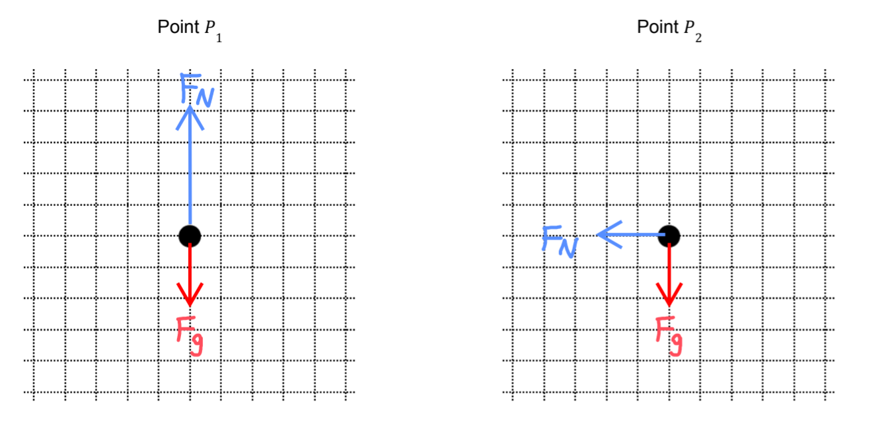
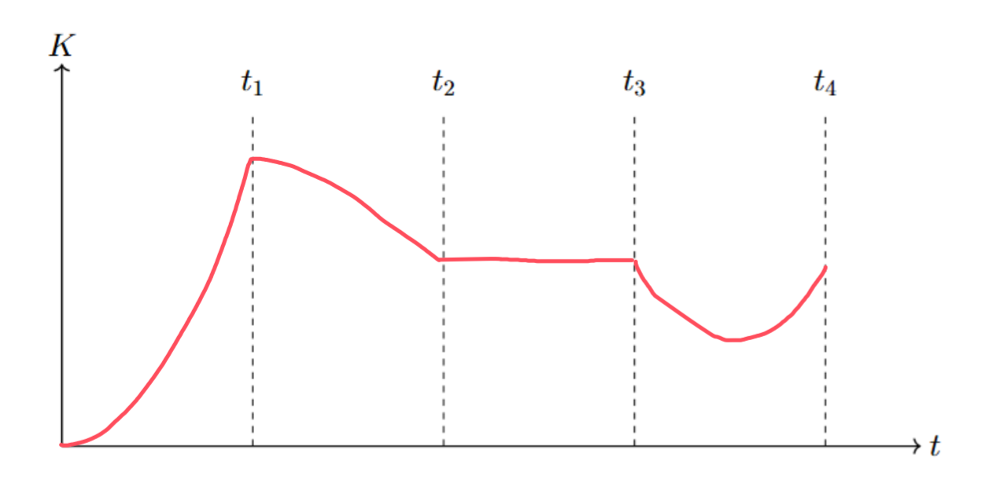

[Scoring Guidelines for Wisusik.MECH.TBR.003]{.underline}

**Highest Possible Score:** 12 Points

a.) 3 Points

+--------------------------------------------------------------+-------+
| For drawing and labeling constant magnitude downwards        | 1     |
| gravitational force at each location, and a normal force     | Point |
| pointing towards the center of the circle at each location   |       |
|                                                              |       |
| *\*Scoring Note\**                                           |       |
|                                                              |       |
| *Reject any labels of centripetal force*                     |       |
+==============================================================+=======+
| For a net force component acting towards the center of the   | 1     |
| circle in each diagram                                       | Point |
+--------------------------------------------------------------+-------+
| For an indication that the normal force at $P_{1}$ is        | 1     |
| greater in magnitude than the normal force at $P_{2}$        | Point |
+--------------------------------------------------------------+-------+

*[Example Solution]{.underline}*

{width="7.7488035870516185in"
height="3.737804024496938in"}

b.) 4 Points

  -----------------------------------------------------------------------
  For a multi step derivation using conservation of energy       1 Point
  -------------------------------------------------------------- --------
  For correctly computing the magnitude of the work done by      1 Point
  friction as $2\mu MgR$                                         

  For correctly identifying the velocity at the top of the loop  1 Point
  as $v =$                                                       

  For a correct final answer, $H_{Min} =$ $($$\frac{3}{2}$       1 Point
  $+ 2\mu)R$                                                     
  -----------------------------------------------------------------------

*[Example Solution]{.underline}*

$E_{0} = E_{f}$

$U_{0} =$ $U_{f} + K_{f} + W_{friction}$

$MgH_{Min} =$ $Mg(2R) +$ $\frac{1}{2}$ $M{v_{Top}}^{2} + \mu Mg(2R)$

$F_{Centripetal,\ Top} = F_{g}$

$\frac{M{v_{Top}}^{2}}{R}$ $= Mg$

${v_{Top}}^{2} = gR$

$MgH_{Min} =$ $2MgR +$ $\frac{1}{2}$ $M(gR) + 2\mu MgR$

$H_{Min} =$$\ ($$\frac{3}{2}$ $+ 2\mu)R$

c.) 3 Points

  -----------------------------------------------------------------------
  For a graph that increases from $0 < t < t_{1}$ and decreases  1 Point
  from $t_{1} < t < t_{2}$                                       
  -------------------------------------------------------------- --------
  For a graph that is constant from $t_{2} < t < t_{3}$          1 Point

  For a graph that decreases then increases from                 1 Point
  $t_{3} < t < t_{4}$, with $K(t_{3}) = K(t_{4})$                
  -----------------------------------------------------------------------

*\*Scoring Note\**

*Linear segments can earn full points for all parts*

*[Example Solution]{.underline}*

{width="7.883833114610674in"
height="3.9086045494313213in"}

d.) 2 Points

  -----------------------------------------------------------------------
  For indicating the value of $H_{Min}$ will increase            1 Point
  -------------------------------------------------------------- --------
  For indicating that the graph will reach a lower value at      1 Point
  $t = t_{3}$                                                    

  -----------------------------------------------------------------------

*\*Scoring Note\**

*If more than two changes are listed, deduct one point from this part
for every incorrect statement, for a minimum score of 0/2 on this part*

*[Example Solution]{.underline}*

-   *Increasing the value of* $\mu$ *will increase the value of*
    $H_{Min}$

-   *Increasing the value of* $\mu$ *would result in a lower value of
    the crate's kinetic energy at* $t = t_{3}$
