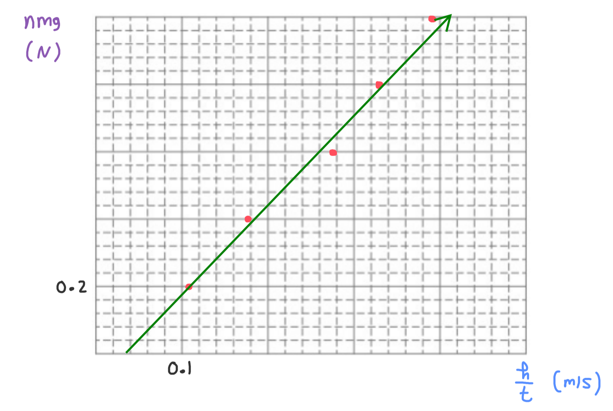

[Scoring Guidelines for Wisusik.MECH.LAB.001]{.underline}

**Highest Possible Score:** 10 Points

a.) 2 Points

  -----------------------------------------------------------------------
  For indicating that the motion sensor should record the        1 Point
  velocity and the acceleration of the falling object            
  -------------------------------------------------------------- --------
  For indicating that the measurements should be taken for       1 Point
  multiple different times                                       

  -----------------------------------------------------------------------

*[Example Solution]{.underline}*

-   *Configure the sensor to output the velocity* $v$ *and acceleration*
    $a$ *of the object*

-   *Drop the object from rest, and start recording data*

-   *Continue to take velocity and acceleration measurements for
    multiple times while the object is falling to reduce uncertainty*

b.) 2 Points

  -----------------------------------------------------------------------
  For a valid graph that could be used to determine whether the  1 Point
  drag force is proportional to $v^{2}$                          
  -------------------------------------------------------------- --------
  For a valid method of analyzing the graph to determine whether 1 Point
  the drag force is proportional to $v^{2}$                      

  -----------------------------------------------------------------------

*[Example Solution]{.underline}*

-   *Graph* $a$ *versus* $v^{2}$ *for the object*

-   *Since the net force on the object is proportional to its
    acceleration, a linear graph of* $a$ *vs* $v^{2}$ *would imply that
    the drag force is proportional to* $v^{2}$

-   *Thus, if a graph of* $a$ *versus* $v^{2}$ *is approximately linear,
    the drag force is likely proportional to* $v^{2}$

c.) 4 Points

i.) 1 Point

+--------------------------------------------------------------+-------+
| For a correct choice of quantities that could be graphed to  | 1     |
| yield a straight line                                        | Point |
|                                                              |       |
| with the same functional dependence as                       |       |
| $n\ vs\ \ $$\frac{1}{t}$                                     |       |
+==============================================================+=======+
+--------------------------------------------------------------+-------+

*[Example Solution]{.underline}*

$F_{g} = F_{Drag}$

$nmg = Cv_{T}$

$nmg = C$ $\frac{h}{t}$

$\lbrack nmg\rbrack = (C)$ $\lbrack\frac{h}{t}\rbrack$

ii.) 3 Points

  -----------------------------------------------------------------------
  For using a set of properly labeled axes (with a scale +       1 Point
  units), and using at least half of the available grid space    
  -------------------------------------------------------------- --------
  For correctly transforming and plotting the data using the     1 Point
  quantities indicated in part (i.)                              

  For drawing a best fit line that approximates the data         1 Point
  -----------------------------------------------------------------------

*[Example Solution]{.underline}*

{width="8.073555336832897in"
height="5.4238888888888885in"}

d.) 2 Points

+--------------------------------------------------------------+-------+
| For correctly relating the slope of the line to the constant | 1     |
| $C$                                                          | Point |
+==============================================================+=======+
| For a final answer consistent with the slope of the line     | 1     |
| graphed and identified relationship                          | Point |
|                                                              |       |
| (Correct Final Answer: $C \approx 2.8\ $ $\frac{N}{m/s}$ )   |       |
+--------------------------------------------------------------+-------+

*[Example Solution]{.underline}*

$\lbrack nmg\rbrack = (C)*\lbrack\frac{h}{t}\rbrack$

Linear Regression: $y = (2.78)x - (0.115)$

$Slope = C$

$C = 2.78$ $\frac{N}{m/s}$
