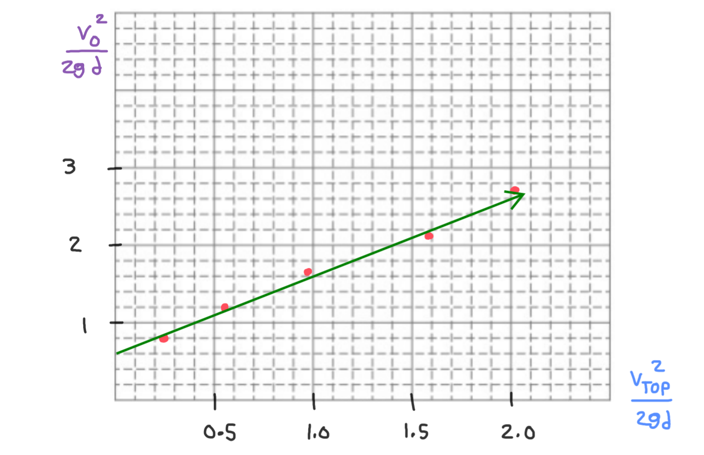

[Scoring Guidelines for Wisusik.MECH.LAB.002]{.underline}

**Highest Possible Score:** 10 Points

a.) 2 Points

  -----------------------------------------------------------------------
  For indicating that the force required to move the block at    1 Point
  constant speed should be measured                              
  -------------------------------------------------------------- --------
  For repeating the experiment with different amounts of mass    1 Point
  attached to the block                                          

  -----------------------------------------------------------------------

*[Example Solution]{.underline}*

-   *Using the force probe, measure the amount of horizontal force
    required in order to move the block at constant speed across the
    table*

-   *For each trial, add different amounts of mass to the wooden block,
    recording the total mass* $M$ *of the system, and the force* $F$
    *required to move the system at constant velocity*

b.) 2 Points

  -----------------------------------------------------------------------
  For a valid linear graph that could be used to calculate       1 Point
  $\mu_{k}$                                                      
  -------------------------------------------------------------- --------
  For a valid analysis to solve for $\mu_{k}$ using the graph    1 Point

  -----------------------------------------------------------------------

-   *When the block moves at constant velocity, the forces are balanced,
    so the applied force* $F$ *is the same as the force of kinetic
    friction,* $F = f_{k}$

-   *Since the experiment is on a flat surface, we can write*
    $f_{k} = \mu_{k}Mg$*, so graphing the required force* $F$ *vs the
    total weight* $Mg$ *of the system will yield a straight line with
    slope* $\mu_{k}$

-   *Thus, graph* $F$ *vs* $Mg$*, and* $\mu_{k}$ *will be the slope of
    the best-fit line*

c.) 4 Points

i.) 1 Point

+--------------------------------------------------------------+-------+
| For a correct choice of quantities that could be graphed to  | 1     |
| yield a straight line                                        | Point |
|                                                              |       |
| with the same functional dependence as                       |       |
| ${v_{0}}^{2}\ \ vs\ \ {v_{Top}}^{2}$                         |       |
+==============================================================+=======+
+--------------------------------------------------------------+-------+

*[Example Solution]{.underline}*

$K_{0} + U_{0} = K_{f} + U_{f}$

$\frac{1}{2}M{v_{0}}^{2} + 0 = \frac{1}{2}M{v_{Top}}^{2} + MgH$

$\frac{1}{2}M{v_{0}}^{2} = \frac{1}{2}M{v_{Top}}^{2} + Mg(d\sin\theta)$

$\frac{1}{2}{v_{0}}^{2} = \frac{1}{2}{v_{Top}}^{2} + g(d\sin\theta)$

${v_{0}}^{2} = {v_{Top}}^{2} + 2gd\sin\theta$

$\frac{{v_{0}}^{2}}{2gd}$ $=$ $\frac{{v_{Top}}^{2}}{2gd}$ $+ \sin\theta$

$\lbrack\frac{{v_{0}}^{2}}{2gd}\rbrack$ $= (1)$
$\lbrack\frac{{v_{Top}}^{2}}{2gd}\rbrack$ $+ \sin\theta$

ii.) 3 Points

  -----------------------------------------------------------------------
  For using a set of properly labeled axes (with a scale +       1 Point
  units), and using at least half of the available grid space    
  -------------------------------------------------------------- --------
  For correctly transforming and plotting the data using the     1 Point
  quantities indicated in part (i.)                              

  For drawing a best fit line that approximates the data         1 Point
  -----------------------------------------------------------------------

*[Example Solution]{.underline}*

{width="7.9776531058617675in"
height="5.165018591426072in"}

d.) 2 Points

+--------------------------------------------------------------+-------+
| For correctly relating the slope of the line to the angle of | 1     |
| the incline $\theta$                                         | Point |
+==============================================================+=======+
| For a final answer consistent with the slope of the line     | 1     |
| graphed and identified relationship                          | Point |
|                                                              |       |
| (Correct Final Answer: $\theta \approx 38\ {^\circ}\ $)      |       |
+--------------------------------------------------------------+-------+

*[Example Solution]{.underline}*

$\lbrack\frac{{v_{0}}^{2}}{2gd}\rbrack$ $= (1)$
$\lbrack\frac{{v_{Top}}^{2}}{2gd}\rbrack$ $+ \sin\theta$

Linear Regression: $y = (1.01)x + (.61)$

$y_{Int} = \sin\theta$

$\theta = \sin^{- 1}(y_{Int}) = \sin^{- 1}(0.61)$

$\theta = 37.6$ ${^\circ}$
