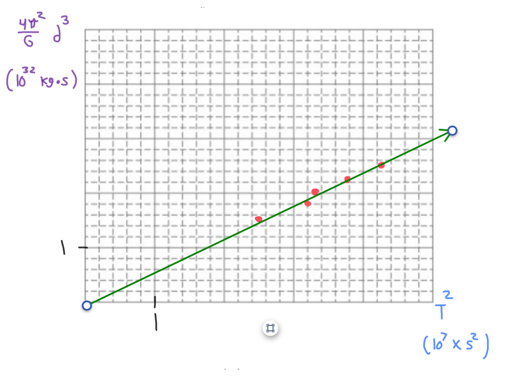

[Scoring Guidelines for Wisusik.MECH.LAB.004]{.underline}

**Highest Possible Score:** 10 Points

a.) 2 Points

  -----------------------------------------------------------------------
  For indicating that the gravitational force should be measured 1 Point
  -------------------------------------------------------------- --------
  For a consistent method of varying a combination of masses and 1 Point
  or distances                                                   

  -----------------------------------------------------------------------

*[Example Solution]{.underline}*

-   Fix the each mass at a constant value $M$

-   Record the force $F$ between the masses as a function of distance
    $r$

-   Repeat for multiple values of $r$

b.) 2 Points

  -----------------------------------------------------------------------
  For indicating a set of quantities consistent with the         1 Point
  previous part that would produce a linear graph                
  -------------------------------------------------------------- --------
  For a correct method of solving for $G$, and indicating that   1 Point
  this value should be compared against the known value of       
  $G = 6.67 \times 10^{- 11}\ Nm^{2}/kg^{2}$                     

  -----------------------------------------------------------------------

*[Example Solution]{.underline}*

-   *Since* $F = G$ $\frac{m_{1}m_{2}}{r^{2}}$*, a graph of*
    $F\ vs\ $$\frac{M^{2}}{r^{2}}$ *will be linear with slope* $G$

-   *Find the slope of the best fit line, and compare this value to the
    accepted result of* $G = 6.67 \times 10^{- 11}\ Nm^{2}/kg^{2}$

-   *If the simulation's value of* $G$ *is close to the actual value,
    then it is likely the simulation is using the real-world value of*
    $G$

c.) 4 Points

i.) 1 Point

+--------------------------------------------------------------+-------+
| For a correct choice of quantities that could be graphed to  | 1     |
| yield a straight line                                        | Point |
|                                                              |       |
| with the same functional dependence as $T^{2}\ vs\ d^{3}$    |       |
+==============================================================+=======+
+--------------------------------------------------------------+-------+

*[Example Solution]{.underline}*

Kepler's Third Law: $T^{2} =$ $\frac{4\pi^{2}}{GM}$ $R^{3}$

$T^{2} =$ $\frac{4\pi^{2}}{GM}$ $d^{3}$

$\lbrack$$\frac{4\pi^{2}}{G}$ $d^{3}\rbrack$
$= (M){\lbrack T}^{2}\rbrack$

ii.) 3 Points

  -----------------------------------------------------------------------
  For using a set of properly labeled axes (with a scale +       1 Point
  units), and using at least half of the available grid space    
  -------------------------------------------------------------- --------
  For correctly transforming and plotting the data using the     1 Point
  quantities indicated in part (i.)                              

  For drawing a best fit line that approximates the data         1 Point
  -----------------------------------------------------------------------

*[Example Solution]{.underline}*

{width="7.453125546806649in"
height="5.685396981627297in"}

d.) 2 Points

+--------------------------------------------------------------+-------+
| For correctly relating the slope of the line to the mass of  | 1     |
| the Earth                                                    | Point |
+==============================================================+=======+
| For a final answer consistent with the slope of the line     | 1     |
| graphed and identified relationship                          | Point |
|                                                              |       |
| (Correct Final Answer: $M \approx 5 \times 10^{24}\ kg$)     |       |
+--------------------------------------------------------------+-------+

*[Example Solution]{.underline}*

$\lbrack$$\frac{4\pi^{2}}{G}$ $d^{3}\rbrack$
$= (M){\lbrack T}^{2}\rbrack$

$y = (5.15 \times 10^{24})x + (2.75 \times 10^{31})$

$Slope = \ M$

$M = 5.15 \times 10^{24}\ \ kg$
