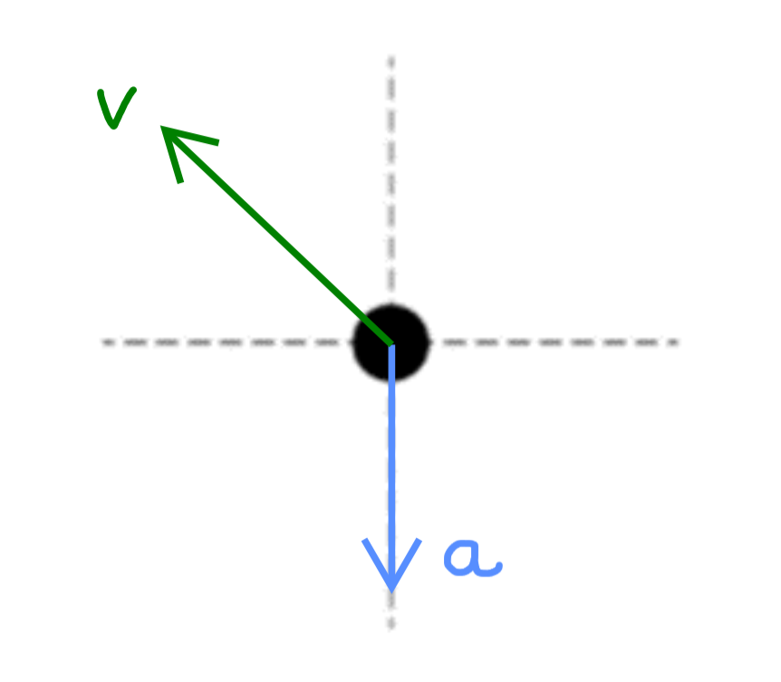

[Scoring Guidelines for Wisusik.MECH.MR.001]{.underline}

**Highest Possible Score:** 10 Points

a.) 7 Points

i.) 2 Points

  -----------------------------------------------------------------------
  For drawing and labeling a single vector $v$ pointing up and   1 Point
  to the left                                                    
  -------------------------------------------------------------- --------
  For drawing and labeling a single vector $a$ pointing down     1 Point

  -----------------------------------------------------------------------

*[Example Solution]{.underline}*

{width="4.588542213473316in"
height="4.001521216097988in"}

ii.) 5 Points

+--------------------------------------------------------------+-------+
| For a multistep derivation using the equations of kinematics | 1     |
| in two dimensions                                            | Point |
+==============================================================+=======+
| For indicating that (relative to the ground), the horizontal | 1     |
| velocity of the projectile is $v_{x} = v_{0}\cos\theta$ and  | Point |
| the initial vertical velocity of the projectile is           |       |
| $v_{y0} = v_{0}\sin\theta$                                   |       |
+--------------------------------------------------------------+-------+
| For indicating the time in the air is $t =$                  | 1     |
| $\frac{\Delta x}{v_{0}\ \cos\theta}$ or $t =$ $\frac{H}{g}$  | Point |
+--------------------------------------------------------------+-------+
| For indicating the horizontal range of the projectile is     | 1     |
| ${\Delta x = v}_{p}T$                                        | Point |
+--------------------------------------------------------------+-------+
| For a consistent final answer in terms of the given          | 1     |
| variables                                                    | Point |
|                                                              |       |
| (Correct Final Answer: $v_{0} =$ $$)                         |       |
+--------------------------------------------------------------+-------+

*[Example Solution]{.underline}*

$\Delta x = v_{x}t_{air}$

$v_{p}T = (v_{0}\cos\theta)t_{air}$

$t_{air} =$ $\frac{v_{p}T}{v_{0}\cos\theta}$

$v_{y} = v_{y0} - gt$

$0 = v_{0}\sin\theta - g$$(\frac{v_{p}T}{v_{0}\cos\theta})$

$0 = {v_{0}}^{2}\sin\theta\cos\theta - gv_{p}T$

$v_{0} =$ $$ or $v_{0} =$ $$

b.) 3 Points

+--------------------------------------------------------------+-------+
| For a multistep derivation involving the relationship        | 1     |
| $\Delta v = \int_{}^{}a(t)dt$                                | Point |
+==============================================================+=======+
| For a correct value of $\Delta v =$ $\frac{a_{0}}{C}$        | 1     |
|                                                              | Point |
+--------------------------------------------------------------+-------+
| For a final answer consistent with previous work and         | 1     |
| $v_{f} = v_{D} + \Delta v$                                   | Point |
|                                                              |       |
| (Correct Final Answer: $v_{f} = v_{D} +$ $\frac{a_{0}}{C}$   |       |
+--------------------------------------------------------------+-------+

*[Example Solution]{.underline}*

$\Delta v = \int_{}^{}a(t)dt$

$= \int_{0}^{\infty}a_{0}e^{- Ct}\ dt$

$= a_{0}\int_{0}^{\infty}e^{- Ct}\ dt$

$= a_{0}$ $\frac{e^{- Ct}}{- C}$ ${|^{\infty}}_{0}$

$= a_{0}(0 -$ $\frac{1}{- C}$$)$

$\Delta v =$ $\frac{a_{0}}{C}$

$v_{f} - v_{0} =$ $\frac{a_{0}}{C}$

$v_{f} = v_{D} +$ $\frac{a_{0}}{C}$
