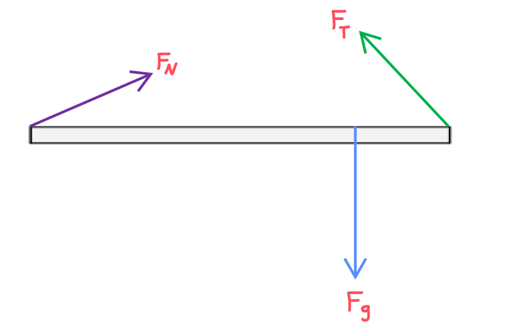

[Scoring Guidelines for Wisusik.MECH.MR.004]{.underline}

**Highest Possible Score:** 10 Points

a.) 7 Points

i.) 2 Points

  -----------------------------------------------------------------------
  For a correct integral expression that could be used to find   1 Point
  the mass of the rod, $m = \int_{}^{}dm = \int_{0}^{L}$         
  $\lambda(x)\ dx$                                               
  -------------------------------------------------------------- --------
  For a correct final answer, $m = 2M$                           1 Point

  -----------------------------------------------------------------------

*[Example Solution]{.underline}*

$m = \int_{}^{}dm = \int_{0}^{L}\lambda(x)dx$

$= \int_{0}^{L}$ $\frac{6M}{L^{3}}$ $x^{2}\ dx$

$=$ $\frac{6M}{L^{3}}$ $\int_{0}^{L}x^{2}dx$

$=$ $\frac{6M}{L^{3}}$ $\frac{x^{3}}{3}{{|_{0}}^{L}}_{}$

$=$ $\frac{6M}{L^{3}}$ $\frac{L^{3}}{3}$

$= 2M$

ii.) 3 Points

+--------------------------------------------------------------+-------+
| For a correct integral expression for finding the center of  | 1     |
| mass of the rod,                                             | Point |
|                                                              |       |
| $x_{cm} =$ $\frac{1}{M_{Tot}}$ $\int_{}^{}x\ dm$             |       |
+==============================================================+=======+
| For correctly evaluating the integral                        | 1     |
| $\int_{0}^{L}x\ \lambda(x)dx =$ $\frac{3}{2}$ $ML$           | Point |
+--------------------------------------------------------------+-------+
| For a final answer in terms of $L$, consistent with the      | 1     |
| value of $M_{Tot}$ from the previous problem                 | Point |
+--------------------------------------------------------------+-------+

*[Example Solution]{.underline}*

$x_{cm} =$ $\frac{1}{M_{Tot}}$ $\int_{}^{}x\ dm$

$=$ $\frac{1}{(2M)}$ $\int_{0}^{L}x\ (\lambda\ dx)$

$=$ $\frac{1}{2M}$ $\int_{0}^{L}x\ ($ $\frac{6M}{L^{3}}$ $x^{2}\ dx)$

$=$ $\frac{3}{L^{3}}$ $\frac{x^{4}}{4}{{|_{0}}^{L}}_{}$

$=$ $\frac{3}{L^{3}}$ $\frac{L^{4}}{4}$

$x_{cm} =$ $\frac{3}{4}$ $L$

iii.) 2 Points

  -----------------------------------------------------------------------
  For drawing and labeling a downwards gravitational force at a  1 Point
  position consistent with the answer from part (ii.)            
  -------------------------------------------------------------- --------
  For drawing and labeling a tension force acting upwards and to 1 Point
  the left, and drawing a force from the hinge with a rightwards 
  component                                                      

  -----------------------------------------------------------------------

*[Example Solution]{.underline}*

{width="6.410744750656168in"
height="4.185709755030621in"}

b.) 3 Points

+--------------------------------------------------------------+-------+
| For a correct expression for the moment of inertia of the    | 1     |
| rod, $I =$ $\frac{6}{5}$ $ML^{2}$                            | Point |
+==============================================================+=======+
| For an expression for the net torque consistent with         | 1     |
| previous results                                             | Point |
+--------------------------------------------------------------+-------+
| For a consistent substitution into Newton's Second Law,      | 1     |
| $\alpha =$ $\frac{\tau}{I}$                                  | Point |
|                                                              |       |
| (Correct Final Answer: $\alpha =$ $\frac{5}{4}\ \frac{g}{L}$ |       |
+--------------------------------------------------------------+-------+

*[Example Solution]{.underline}*

$\alpha =$ $\frac{\tau_{Net}}{I}$

$\tau_{Net} = \tau_{g} = (2Mg)($$\frac{3}{4}$$L)$

$\tau_{Net} =$ $\frac{3}{2}$ $MgL$

$I = \int_{}^{}x^{2}dm$

$= \int_{0}^{L}x^{2} \cdot \lambda(x)dx$

$=$ $\int_{0}^{L}x^{2}\ ($ $\frac{6M}{L^{3}}$ $x^{2}\ dx)$

$=$ $\frac{6M}{L^{3}}$ $\frac{x^{5}}{5}{{|_{0}}^{L}}_{}$

$=$ $\frac{6}{5}$ $ML^{2}$

$\alpha =$ $\frac{\tau_{Net}}{I}$ $=$
$\frac{\frac{3}{2}\ MgL}{\frac{6}{5}\ ML^{2}}$

$\alpha =$ $\frac{5}{4}\ \frac{g}{L}$
