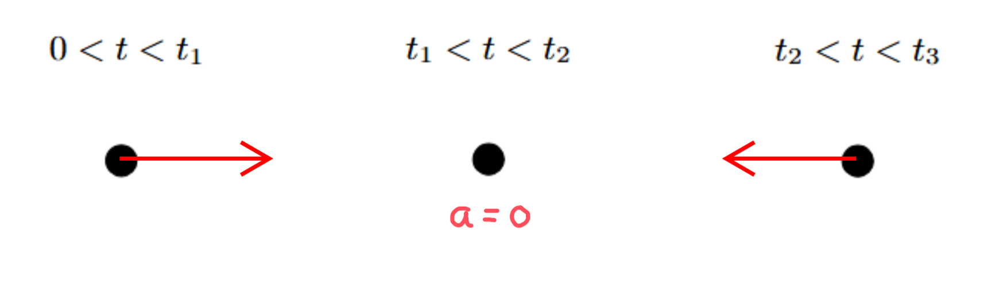
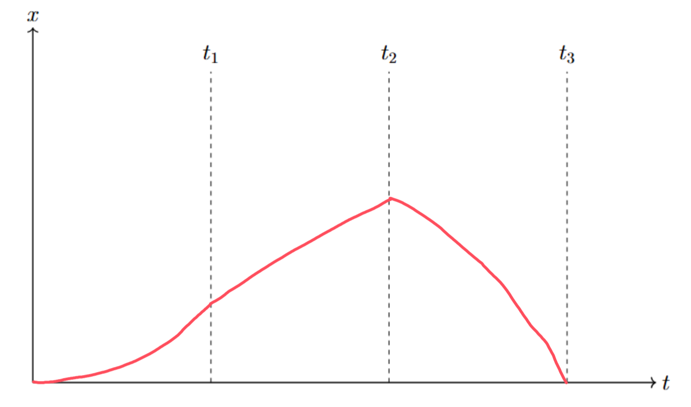

[Scoring Guidelines for Wisusik.MECH.TBR.001]{.underline}

**Highest Possible Score:** 12 Points

a.) 3 Points

  -----------------------------------------------------------------------
  For drawing a rightward acceleration vector for                1 Point
  $0 < t < t_{1}$                                                
  -------------------------------------------------------------- --------
  For writing $a = 0$ for $t_{1} < t < t_{2}$                    1 Point

  For drawing a leftward acceleration vector for                 1 Point
  $t_{2} < t < t_{3}$                                            
  -----------------------------------------------------------------------

*[Example Solution]{.underline}*

{width="7.641910542432196in"
height="2.2166437007874014in"}

b.) 4 Points

+--------------------------------------------------------------+-------+
| For a multi step derivation that involves summing the        | 1     |
| displacements from each segment                              | Point |
+==============================================================+=======+
| For correctly using kinematics to find that the displacement | 1     |
| from $t = 0$ to $t = t_{2}$ is $\frac{v_{Max}t_{1}}{2}$ $+$  | Point |
| $v_{Max}{(t}_{2} - t_{1})$                                   |       |
+--------------------------------------------------------------+-------+
| For correctly using calculus to find the displacement from   | 1     |
| $t = t_{2}$ to $t = t_{3}$ is $v_{Max}(t_{3} - t_{2}) -$     | Point |
| $\frac{(t_{3} - t_{2})^{3}}{3}$                              |       |
+--------------------------------------------------------------+-------+
| For a final answer showing a consistent summation of all     | 1     |
| displacements                                                | Point |
|                                                              |       |
| (Correct Final Answer: $\Delta x =$ $\frac{v_{Max}t_{1}}{2}$ |       |
| $+$ $v_{Max}{(t}_{2} - t_{1}) +$ $v_{Max}(t_{3} - t_{2}) -$  |       |
| $\frac{(t_{3} - t_{2})^{3}}{3}$)                             |       |
|                                                              |       |
| (or $\Delta x =$ $v_{Max}(t_{3} - \frac{t_{1}}{2})$ $-$      |       |
| $\frac{(t_{3} - t_{2})^{3}}{3}$)                             |       |
+--------------------------------------------------------------+-------+

*[Example Solution]{.underline}*

$\Delta x = \Delta x_{1} + \Delta x_{2} + \Delta x_{3}$

$\Delta x_{1} =$ $\frac{v_{0} + v_{f}}{2}$ $\Delta t$

$=$ $\frac{v_{Max}}{2}$ $t_{1}$

$\Delta x_{2} = v\Delta t$

$= v_{Max}{(t}_{2} - t_{1})$

$\Delta x_{3} = \int_{t_{2}}^{t_{3}}v(t)dt$

$= \ \int_{t_{2}}^{t_{3}}v_{Max} - (t - t_{2})^{2}dt$

$= v_{Max}(t_{3} - t_{2}) -$ $\frac{(t_{3} - t_{2})^{3}}{3}$

$\Delta x =$ $\frac{v_{Max}}{2}$ $t_{1} +$ $v_{Max}{(t}_{2} - t_{1})$
$+$ $v_{Max}(t_{3} - t_{2}) -$ $\frac{(t_{3} - t_{2})^{3}}{3}$

c.) 3 Points

  -----------------------------------------------------------------------
  For a concave up graph on $0 < t < t_{1}$                      1 Point
  -------------------------------------------------------------- --------
  For a linear, increasing graph on $t_{1} < t < t_{2}$ that is  1 Point
  differentiable at $t = t_{1}$                                  

  For a concave down graph that decreases to zero on             1 Point
  $t_{2} < t < t_{3}$                                            
  -----------------------------------------------------------------------

*[Example Solution]{.underline}*

{width="7.5438692038495185in"
height="4.448949037620298in"}

d.) 2 Points

  -----------------------------------------------------------------------
  For a valid claim relating to the consistency of the two       1 Point
  representations                                                
  -------------------------------------------------------------- --------
  For a valid justification                                      1 Point

  -----------------------------------------------------------------------

*[Example Solution]{.underline}*

-   *The graph drawn in part (c.) is consistent with the acceleration
    vectors drawn in part (a.)*

-   *The acceleration was drawn pointing to the right on the interval*
    $0 < t < t_{1}$

-   *The acceleration was stated to be zero on the interval*
    $t_{1} < t < t_{2}$

-   *The acceleration was drawn pointing to the left on the interval*
    $t_{2} < t < t_{3}$

-   *The graph in part (c.) is consistent with these drawings, since
    acceleration is the second derivative of position*

    -   *The concavity of the first segment was positive, the concavity
        of the second segment was zero, and the concavity of the third
        segment was negative*
