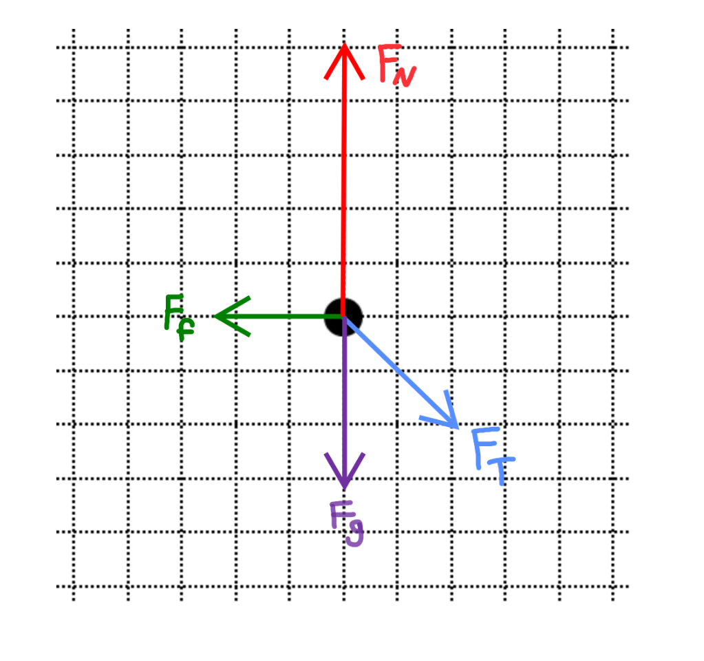
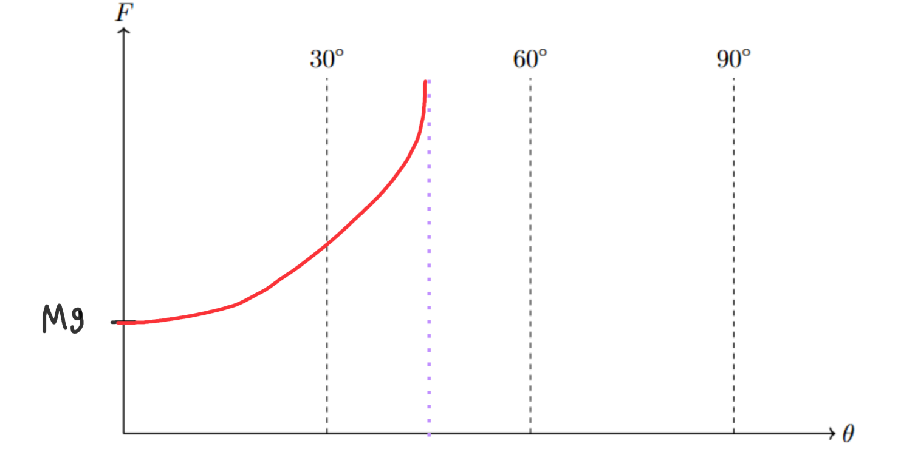

[Scoring Guidelines for Wisusik.MECH.TBR.002]{.underline}

**Highest Possible Score:** 12 Points

a.) 3 Points

+--------------------------------------------------------------+-------+
| For correctly drawing and labeling all four forces acting on | 1     |
| the crate, with correct direction:                           | Point |
|                                                              |       |
| -   Normal Force (Up)                                        |       |
|                                                              |       |
| -   Gravitational Force (Down),                              |       |
|                                                              |       |
| -   Applied force (Down + Right)                             |       |
|                                                              |       |
| -   Friction Force (Left)                                    |       |
+==============================================================+=======+
| For indicating the presence of horizontal forces, and the    | 1     |
| horizontal net force on the system is zero                   | Point |
+--------------------------------------------------------------+-------+
| For indicating the presence of vertical forces, and the      | 1     |
| vertical net force on the system is zero                     | Point |
+--------------------------------------------------------------+-------+

*[Example Solution]{.underline}*

{width="4.723958880139983in"
height="4.423343175853018in"}

b.) 4 Points

+--------------------------------------------------------------+-------+
| For a derivation starting from balanced forces or            | 1     |
| $F_{Net} = 0$                                                | Point |
+==============================================================+=======+
| For setting the frictional force equal to the horizontal     | 1     |
| component of the applied force, $F\cos\theta = \mu_{k}F_{N}$ | Point |
+--------------------------------------------------------------+-------+
| For a correct expression for the normal force acting on the  | 1     |
| crate                                                        | Point |
|                                                              |       |
| $F_{N} = Mg + F\sin\theta$                                   |       |
+--------------------------------------------------------------+-------+
| For a final answer consistent with previous work             | 1     |
|                                                              | Point |
| (Correct Final Answer: $F =$                                 |       |
| $\frac{\mu\ Mg}{\cos\theta\  - \mu\ \sin\theta}$ )           |       |
+--------------------------------------------------------------+-------+

*[Example Solution]{.underline}*

$F_{Net} = 0$

$F_{app,\ x} = f_{k}$

$F\cos\theta = \mu F_{N}$

$F_{N} = F_{g} + F_{app,\ y}$

$F_{N} = Mg + F\sin\theta$

$F\cos\theta = \mu F_{N}$

$F\cos\theta = \mu$($Mg + F\sin\theta$)

$F\cos\theta - \mu F\sin\theta = \mu Mg$

$F(\cos\theta - \mu\sin\theta) = \mu Mg$

$F =$ $\frac{\mu Mg}{\cos\theta - \mu\sin\theta}$

$$

c.) 3 Points

  -----------------------------------------------------------------------
  For a graph with a nonzero, labeled y-intercept of $Mg$        1 Point
  -------------------------------------------------------------- --------
  For drawing an increasing curve on                             1 Point
  $0{^\circ} < \theta < 45{^\circ}$ with a vertical asymptote at 
  $\theta = 45$°                                                 

  For drawing nothing in the region $\theta \geq$ 45°            1 Point
  -----------------------------------------------------------------------

*[Example Solution]{.underline}*

{width="7.7398304899387576in"
height="4.080237314085739in"}

d.) 2 Points

  -----------------------------------------------------------------------
  For a valid claim about the consistency of the two             1 Point
  representations                                                
  -------------------------------------------------------------- --------
  For a valid justification                                      1 Point

  -----------------------------------------------------------------------

*[Example Solution]{.underline}*

-   *The expression derived in part (b.) is consistent with a vertical
    asymptote at* $\theta = 45$*°*

-   *In the expression* $F =$ $\frac{Mg}{\cos\theta - \sin\theta}$, *the
    function is undefined when the denominator is equal to zero*

-   *Solving* $\cos\theta - \sin\theta = 0$ *yields* $\theta = 45$*°*

-   *Thus, there will be a vertical asymptote at* $\theta = 45$*° on a
    graph of* $F\ vs\ \theta$
