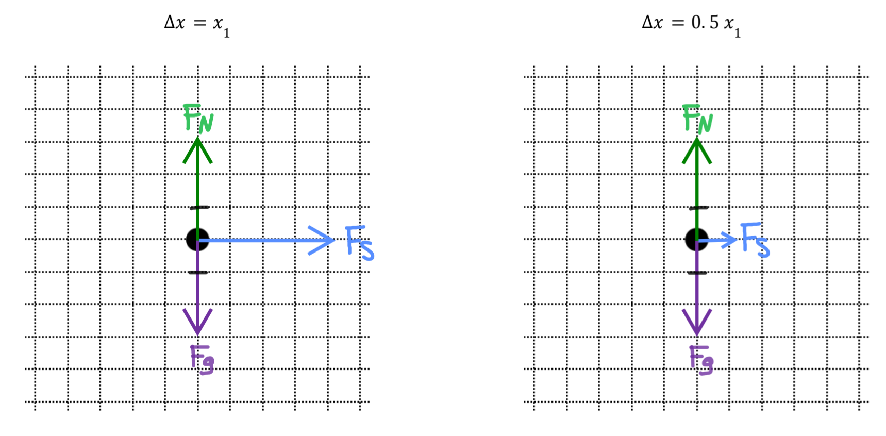
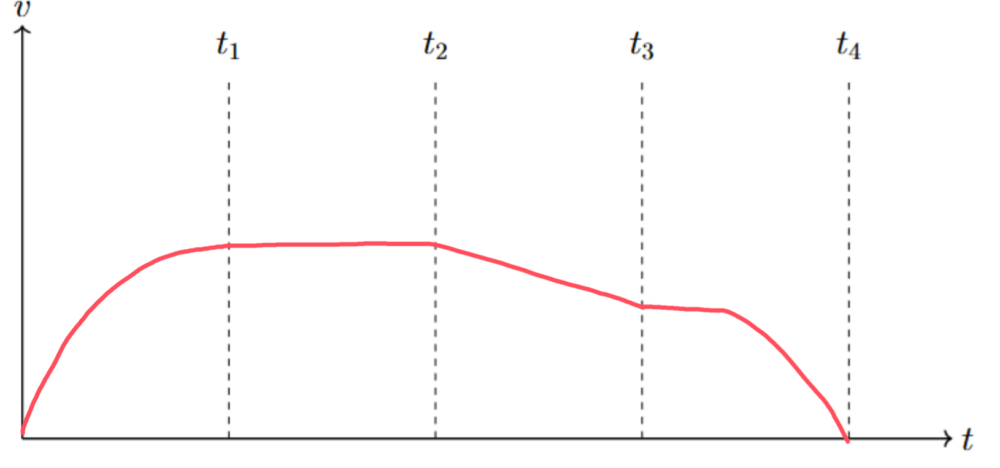

[Scoring Guidelines for Wisusik.MECH.TBR.004]{.underline}

**Highest Possible Score:** 12 Points

a.) 3 Points

  -----------------------------------------------------------------------
  For drawing and labeling equal and opposite gravitational and  1 Point
  normal forces on the block at both positions, and no other     
  vertical forces                                                
  -------------------------------------------------------------- --------
  For drawing a rightwards spring force on the block at each     1 Point
  position, and no other horizontal forces                       

  For drawing a spring force at $x_{1}$ that is four times       1 Point
  greater in magnitude than the spring force at $0.5{\ x}_{1}$   
  -----------------------------------------------------------------------

*[Example Solution]{.underline}*

{width="7.432292213473316in"
height="3.6518186789151357in"}

b.) 4 Points

+--------------------------------------------------------------+-------+
| For a multistep derivation that uses conservation of energy, | 1     |
| $E_{0} = E_{f}$                                              | Point |
+==============================================================+=======+
| For a correct expression for the energy storing in the       | 1     |
| nonlinear spring, $U_{0} = {x_{1}}^{3}$                      | Point |
+--------------------------------------------------------------+-------+
| For setting the energy stored in the first spring equal to   | 1     |
| the sum of the energy stored in the second spring and the    | Point |
| gravitational potential energy, along with consistent        |       |
| substitutions into each energy term:                         |       |
|                                                              |       |
| ${x_{1}}^{3} = mgy +$ $\frac{1}{2}k{x_{2}}^{2}$              |       |
+--------------------------------------------------------------+-------+
| For a correct answer consistent with previous work           | 1     |
|                                                              | Point |
| (Correct Final Answer: $x_{2} =$ $$                          |       |
+--------------------------------------------------------------+-------+

*[Example Solution]{.underline}*

$E_{0} = E_{f}$

$U_{0} = \ U_{g,f} + U_{Spring,\ Ideal}$

$U_{0} = \ \int_{0}^{x_{1}}F(x)dx = \int_{0}^{x_{1}}3x^{2}\ dx\  = \ {x_{1}}^{3}$

${x_{1}}^{3} = mgy +$ $\frac{1}{2}k{x_{2}}^{2}$

${x_{1}}^{3} - mgy =$ $\frac{1}{2}k{x_{2}}^{2}$

$x_{2} =$ $$

c.) 3 Points

  -----------------------------------------------------------------------
  For a concave down increasing graph on $0 < t < t_{1}$         1 Point
  -------------------------------------------------------------- --------
  For a constant graph on $t_{1} < t < t_{2}$                    1 Point

  For a graph that decreases linearly on $t_{2} < t < t_{3}$,    1 Point
  and reaches zero at $t = t_{4}$                                
  -----------------------------------------------------------------------

*[Example Solution]{.underline}*

{width="7.300479002624672in"
height="3.41625in"}

d.) 2 Points

  -----------------------------------------------------------------------
  For a correct claim about the consistency of the two           1 Point
  representations                                                
  -------------------------------------------------------------- --------
  For a valid justification                                      1 Point

  -----------------------------------------------------------------------

*[Example Solution]{.underline}*

-   *The two representations are consistent with one another*

-   *In part (a.), I showed that the net force on the block is highest
    while the spring is fully compressed*

-   *This is consistent with the graph in part (c.) which is concave
    down on the interval of time when the block is attached to the
    spring*

    -   *This means that the acceleration of the block must be
        decreasing*

    -   *Thus the net force on the block must therefore also be
        decreasing on that time interval, which is shown in the free
        body diagrams in part (a.)*
