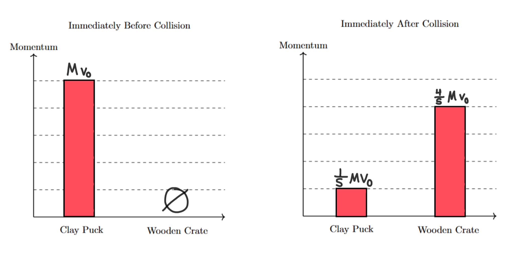
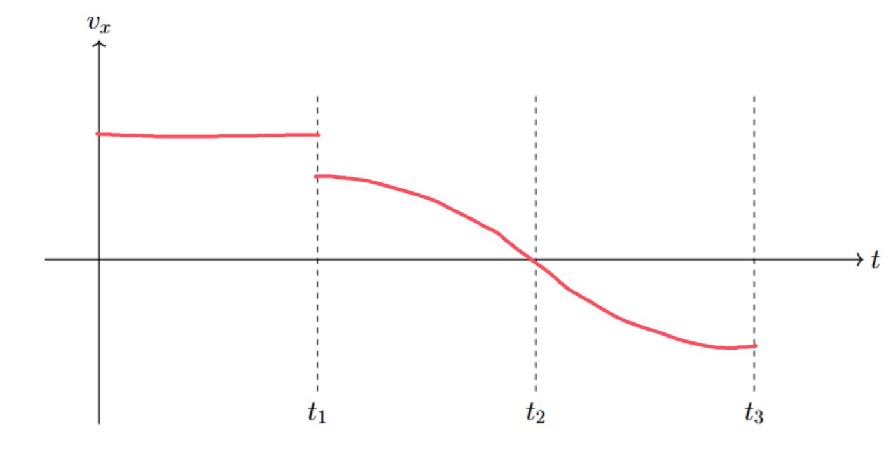

[Scoring Guidelines for Wisusik.MECH.TBR.005]{.underline}

**Highest Possible Score:** 12 Points

a.) 3 Points

  -----------------------------------------------------------------------
  For indicating the crate has zero momentum before the          1 Point
  collision, and nonzero momentum after the collision            
  -------------------------------------------------------------- --------
  For indicating the respective momentum values of the puck      1 Point
  before and after the collision are $Mv_{0}$ and $\frac{1}{5}$  
  $Mv_{0}$                                                       

  For a set of graphs showing the system's total momentum is     1 Point
  conserved                                                      
  -----------------------------------------------------------------------

*[Example Solution]{.underline}*

{width="8.177083333333334in"
height="4.2851935695538055in"}

b.) 4 Points

+--------------------------------------------------------------+-------+
| For an application of conservation of momentum before and    | 1     |
| after the collision                                          | Point |
+==============================================================+=======+
| For indicating the velocity after the collision as           | 1     |
| $\frac{1}{5}$ $v_{0}$                                        | Point |
+--------------------------------------------------------------+-------+
| For an application of conservation of energy as the crate    | 1     |
| swings                                                       | Point |
+--------------------------------------------------------------+-------+
| For a final answer consistent with the calculation of the    | 1     |
| speed of the system after the collision:                     | Point |
|                                                              |       |
| (Correct Final Answer: $v_{0} = )$                           |       |
+--------------------------------------------------------------+-------+

*[Example Solution]{.underline}*

$\sum_{}^{}{\overrightarrow{p}}_{Before\ Collision} = \sum_{}^{}{\overrightarrow{p}}_{After\ Collision}$

$Mv_{0} = (M + 4M)v_{Bottom}$

$v_{Bottom} =$ $\frac{1}{5}$ $v_{0}$

$K_{Bottom} + U_{Bottom} = K_{Top} + U_{Top}$

$\frac{1}{2}$ $(5M){v^{2}}_{Bottom} = (5M)gH$

$\frac{1}{2}$ ${v^{2}}_{Bottom} = gL(1 - \cos\theta)$

$v_{Bottom} = )$

$v_{0} = )$

c.) 3 Points

  -----------------------------------------------------------------------
  For drawing a constant nonzero horizontal line in the region   1 Point
  $t < t_{1}$                                                    
  -------------------------------------------------------------- --------
  For drawing a segment between $t_{1}$ and $t_{2}$ that begins  1 Point
  lower than the graph's value in the region $t < t_{1}$, and    
  reaches zero at ${t = t}_{2}$                                  

  For drawing a segment in the region $t_{2} < t < t_{3}$ that   1 Point
  has odd symmetry with respect to $t = t_{2}$                   
  -----------------------------------------------------------------------

*[Example Solution]{.underline}*

{width="8.094470691163604in"
height="4.215870516185477in"}

d.) 2 Points

  -----------------------------------------------------------------------
  For a correct change                                           1 Point
  -------------------------------------------------------------- --------
  For a valid justification                                      1 Point

  -----------------------------------------------------------------------

*[Example Solution]{.underline}*

-   *The graph will now begin at a lower value immediately after the
    collision*

-   *The increased mass of the system will result in a lower velocity of
    the system after the collision, so the graph's value directly after*
    $t = t_{1}$ *should decrease*
