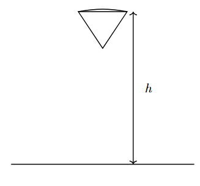

*Suggested Time: 25-30 minutes*

3.) A group of students are investigating the drag force acting on a set
of falling objects. The students hypothesize that the magnitude of the
drag force is proportional to the square of the velocity of the falling
object. The objects are dropped from small heights, meaning the objects
do not approach a significant fraction of their terminal velocity before
hitting the ground. In addition to standard physics laboratory
equipment, the students have access to motion sensors that can determine
the position, velocity, and acceleration of the falling object at any
given time.

a.) **Design** an experimental procedure the students could use to
collect data that would allow them to use a graph to determine whether
drag force is proportional to the square of a falling object's velocity.
Clearly explain how the equipment presented above should be used to
collect the necessary measurements, and provide enough detail so that
the experiment could be replicated, including any steps necessary to
reduce experimental uncertainty.

b.) **Describe** how the data could be analyzed using a graph to
determine whether the drag force is proportional to the square of the
falling object's velocity

c.) Another group of students drop a set of coffee filters from a large
height of $h = 5\ m$. The filters can be assumed to reach terminal speed
almost directly after being dropped due to a significant drag force
given by $F_{Drag} = Cv$, where $v$ is the velocity of the coffee
filter, and $C$ is a constant that the students wish to calculate. The
students vary the number $n$ of identical coffee filters of mass
$m = 0.002\ kg$, and record the time $t$ required for the filters to hit
the ground.

{width="2.8305555555555557in"
height="2.6944444444444446in"}

  -----------------------------------------------------------------------
  $n$               $t\ (s)$                            
  ----------------- ----------------- ----------------- -----------------
  10                46                                  

  20                28                                  

  30                18                                  

  40                15                                  

  50                13                                  
  -----------------------------------------------------------------------

i.) What quantities could be graphed to yield a straight line that could be used to calculate an experimental value for the constant $C$?

Horizontal Axis:\_\_\_\_\_\_\_\_\_\_ Vertical
Axis:\_\_\_\_\_\_\_\_\_\_

Use the remaining columns in the table, as needed, to record any
quantities indicated that are not already provided in the table.
**Label** each column and include units.

ii.) On the grid, **plot** the data points for the quantities
indicated in part (c)(i). Clearly **scale** and **label** all axes,
including units as appropriate. On the same grid, **draw** a straight
line that best represents the data.

{width="6.098958880139983in"
height="4.69919728783902in"}

d.) Using the line drawn in part (c)(ii), along with the given values
$h = 5\ m$ and $m = 0.002\ kg$, **calculate** an experimental value for
the constant $C$
