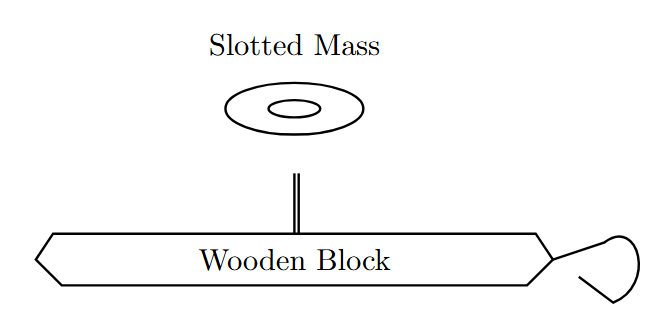
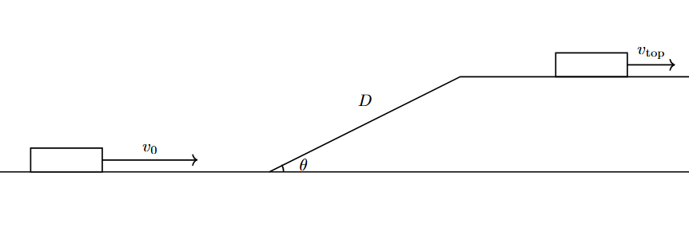
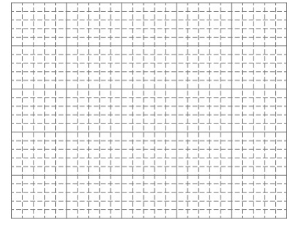

*Suggested Time: 25-30 minutes*

3.) A group of students wish to calculate the coefficient of kinetic
friction $\mu_{k}$ between a wooden block and a table. The students have
access to a digital force sensor that measures the force that the sensor
is being pulled with. The students know the mass of the wooden block,
and have the ability to add additional mass to the system by fixing a
variety of slotted masses to the block.

{width="4.588542213473316in"
height="2.242325021872266in"}

a.) **Design** an experimental procedure the students could use to
collect data that would allow them to calculate $\mu_{k}$ using a linear
graph. Clearly explain how the equipment presented above should be used
to collect the necessary measurements, and provide enough detail so that
the experiment could be replicated, including any steps necessary to
reduce experimental uncertainty.

b.) **Describe** how the data could be analyzed using a linear graph to
calculate $\mu_{k}$

c.) Another group of students construct a ramp of slant length
$d = 1.5\ m$ and angle $\theta$ while investigating conservation of
energy. The students launch a cart up the incline of negligible
friction, and use a motion sensor to measure the launch velocity
$v_{0}$. Upon reaching the top of the incline, the cart's new speed
$v_{Top}$ is measured using another motion sensor.

{width="6.944444444444445in"
height="3.097916666666667in"}

The students' data for various values of $v_{0}$ is shown below:

  ------------------------------------------------------------------------
  $v_{0}\ (m/s)$    $v_{Top}\ (m/s)$                     
  ----------------- ------------------ ----------------- -----------------
  5                 2.7                                  

  6                 4.1                                  

  7                 5.4                                  

  8                 6.9                                  

  9                 7.8                                  
  ------------------------------------------------------------------------

> i.) What quantities could be graphed to yield a straight line that
> could be used to calculate an experimental value for the ramp angle
> $\theta$?
>
> Horizontal Axis:\_\_\_\_\_\_\_\_\_\_ Vertical
> Axis:\_\_\_\_\_\_\_\_\_\_
>
> Use the remaining columns in the table, as needed, to record any
> quantities indicated that are not already provided in the table.
> **Label** each column and include units.
>
> ii.) On the grid, **plot** the data points for the quantities
> indicated in part (c)(i). Clearly **scale** and **label** all axes,
> including units as appropriate. On the same grid, **draw** a straight
> line that best represents the data.
>
> {width="6.098958880139983in"
> height="4.69919728783902in"}

d.) Using the line drawn in part (c)(ii), **calculate** an experimental
value for the ramp angle $\theta$
