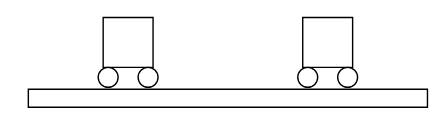

*Suggested Time: 25-30 minutes*

3.) A group of students are collecting data using two identical carts of
known mass that can travel along a frictionless track. Each cart is
equipped with sensors that record the position, velocity, and
acceleration of the cart as a function of time. The students wish to
perform an experiment to determine whether the momentum of the two-cart
system is conserved in all collisions between the carts.

{width="4.703125546806649in"
height="1.3614304461942257in"}

a.) **Design** an experimental procedure the students could use to
collect data that would allow them to determine whether the momentum of
the two-cart system remains constant before and after the two carts
collide. Clearly explain how the equipment presented above should be
used to collect the necessary measurements, and provide enough detail so
that the experiment could be replicated, including any steps necessary
to reduce experimental uncertainty.

b.) **Describe** how the data could be analyzed to determine whether the
momentum of the two-cart system remains constant before and after the
two carts collide.

c.) Another group of students wish to determine the mass of one of the
carts without using a scale. In their experiment, the students release
the cart from rest from an incline, and allow the cart to collide with a
barrier before stopping. The students use the sensors attached to the
cart to record the speed of the cart $v$ before the collision, the
average force $F_{avg}$ exerted on the cart by the barrier, and the
collision time $\Delta t$. The students' data is shown in the table
below:

  -----------------------------------------------------------------------
  $v\ (m/s)$        $F_{avg}\ (N)$    $\Delta t\ (s)$   
  ----------------- ----------------- ----------------- -----------------
  1                 12                0.05              

  2                 14                0.11              

  3                 19                0.12              

  4                 30                0.10              

  5                 40                0.09              
  -----------------------------------------------------------------------

> i.) What quantities could be graphed to yield a straight line that
> could be used to calculate an experimental value for
> \_\_\_\_\_\_\_\_\_?
>
> Horizontal Axis:\_\_\_\_\_\_\_\_\_\_ Vertical
> Axis:\_\_\_\_\_\_\_\_\_\_

Use the remaining columns in the table, as needed, to record any
quantities indicated that are not already provided in the table.
**Label** each column and include units.

> ii.) On the grid, **plot** the data points for the quantities
> indicated in part (c)(i). Clearly **scale** and **label** all axes,
> including units as appropriate. On the same grid, **draw** a straight
> line that best represents the data.
>
> {width="6.098958880139983in"
> height="4.69919728783902in"}

d.) Using the line drawn in part (c)(ii), **calculate** an experimental
value for the mass of the cart
