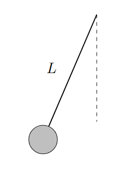
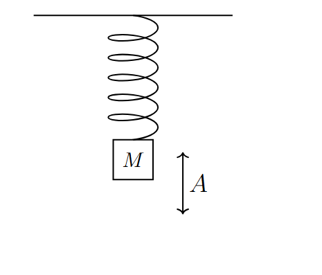

*Suggested Time: 25-30 minutes*

3.) A group of students discover that a yo-yo can act as a simple
pendulum. The students notice that when the yo-yo string is longer, the
period of oscillation increases. As such, the students hypothesize that
the period $T$ of the pendulum is directly proportional to the length
$L$ of the string.

a.) **Design** an experimental procedure the students could use to
collect data that would allow them to collect data to determine whether
the period of the pendulum is directly proportional to the length of the
string. Clearly explain how the equipment presented above should be used
to collect the necessary measurements, and provide enough detail so that
the experiment could be replicated, including any steps necessary to
reduce experimental
uncertainty{width="2.1041666666666665in"
height="2.8422779965004374in"}

b.) **Describe** how the data could be analyzed using a graph to
determine whether the period of the pendulum is directly proportional to
the length of the string

c.) Another group of students are investigating a mass-spring system.
The students connect blocks of different mass $M$ to a spring, and use a
motion sensor to record the maximum acceleration $a_{Max}$ of the system
after displacing the spring a constant distance $A = 0.2\ m$ during each
trial. The student's data for multiple values of $M$ is shown below. The
students wish to calculate an experimental value for $k$, the spring
constant.

{width="3.6978073053368328in"
height="3.1412489063867017in"}

  ----------------------------------------------------------------------------
  $M\ (kg)$         $a_{Max}\ (m/s^{2})$                     
  ----------------- ---------------------- ----------------- -----------------
  0.1               16                                       

  0.2               9                                        

  0.3               3                                        

  0.4               2.5                                      

  0.5               2                                        
  ----------------------------------------------------------------------------

> i.) What quantities could be graphed to yield a straight line that
> could be used to calculate an experimental value for $k$?
>
> Horizontal Axis:\_\_\_\_\_\_\_\_\_\_ Vertical
> Axis:\_\_\_\_\_\_\_\_\_\_
>
> Use the remaining columns in the table, as needed, to record any
> quantities indicated that are not already provided in the table.
> **Label** each column and include units.
>
> ii.) On the grid, **plot** the data points for the quantities
> indicated in part (c)(i). Clearly **scale** and **label** all axes,
> including units as appropriate. On the same grid, **draw** a straight
> line that best represents the data.
>
> {width="6.098958880139983in"
> height="4.69919728783902in"}

d.) Using the line drawn in part (c)(ii), **calculate** an experimental
value for $k$
