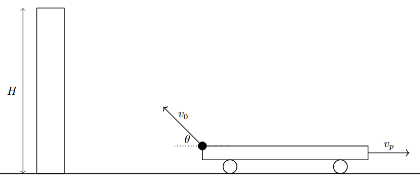
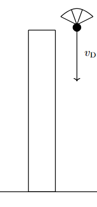

*Suggested Time: 20-25 minutes*

1.) A platform is moving at a constant speed $v_{p}$ to the right. There
is an operated cannon on the platform that can fire a projectile
relative to the platform at a variable velocity at a fixed angle
$\theta$ above the horizontal. The left end of the platform begins
touching a tall tower of height $H$ above where the cannon is fired. The
cannon operator wants to fire the cannon after a time $T$ has elapsed,
and wants to find the launch speed $v_{0}$ such that the fired
projectile will exactly strike the top of the tower with all of its
velocity in the horizontal direction.

{width="6.8341896325459315in"
height="2.979005905511811in"}

a.)

i.) On the dot below, **draw** and **label** the direction of the net
velocity $v$ and net acceleration $a$ of the projectile while it is in
the air traveling towards the tower. If the velocity or acceleration of
the projectile is zero at this time, write "$v = 0$" or "$a = 0$"
respectively below the
dot.{width="2.1041666666666665in"
height="1.9805555555555556in"}

ii.) **Derive** an expression for the launch velocity $v_{0}$ that
ensures the top of the tower will be struck by a horizontally traveling
projectile. Answer in terms of $v_{p},T,H,\theta,$ and physical
constants. Begin your derivation by writing a fundamental physics
principle or an equation from the reference tables.

b.) After the projectile reaches the top of the tower, it is caught, and
equipped with a parachute. The projectile is then thrown downwards from
the top of the tower at an initial speed $v_{Down}$, and experiences
substantial drag. If the downward acceleration of the projectile as a
function of time is given by the expression $a(t) = a_{0}e^{- Ct}$,
**derive** an expression for the speed of the projectile after a long
time. You may assume that the projectile acquires this speed before
reaching the ground.

{width="2.0416666666666665in"
height="4.354166666666667in"}
