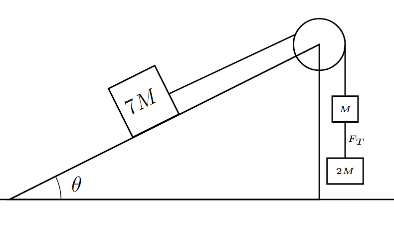
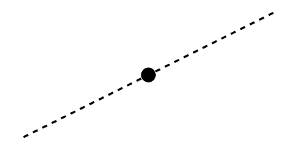
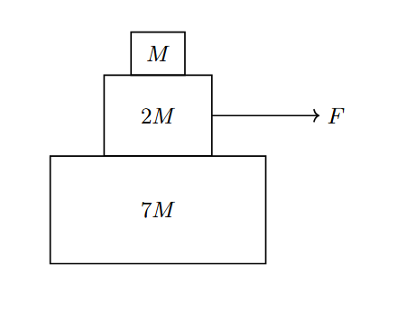

*Suggested Time: 20-25 minutes*

1.) A large crate of mass $7M$ is speeding up while sliding down a rough
inclined plane that makes an angle $\theta$ with the horizontal. The
coefficient of kinetic friction between the crate amd the ramp is $\mu$.
The crate is attached an ideal pulley, which holds additional crates of
mass $M$ and mass $2M$ connected vertically by a series of strings.
{width="5.515625546806649in"
height="3.14168416447944in"}

a.)

i.) **Draw** and **label** the forces (not components) acting on the
crate of mass $7M$ as it slides down the incline. The line drawn below
represents the angle of the inclined plane.

{width="4.244792213473316in"
height="2.2455041557305337in"}

ii.) In terms of the given quantities, **derive** an expression for the
magnitude of the tension force $F_{T}$ in the portion of the string
connecting the two hanging crates of mass $M$ and $2M$. Begin your
derivation by writing a fundamental physics principle or an equation
from the reference tables.

b.) Suppose the blocks are reassembled into a vertical stack as shown
below. There is no friction between the bottom block and the ground, but
all blocks have a shared coefficient of static friction $\mu_{s}$
between them. The middle block is pulled to the right with a force $F$.
{width="3.6623501749781275in"
height="2.8593755468066493in"}

**Derive** an expression for the maximum force horizontal force
$F_{Max}$ that can be applied to the middle block such that all three
blocks move together (meaning the top block does not slip). Begin your
derivation by writing a fundamental physics principle or an equation
from the reference tables.
