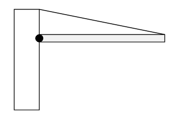
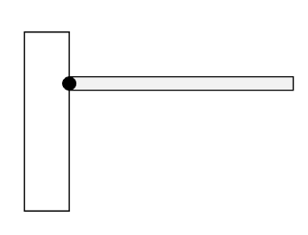

*Suggested Time: 20-25 minutes*

1.) The rod of length $L$ shown below is pivoted against a wall, and
held at rest by a cable. The rod has a nonuniform linear mass density
given by $\lambda(x) =$ $\frac{6M}{L^{3}}$ $x^{2}$, where $x$ is the
distance of a segment of the rod from the wall, and $M$ is a constant
with units of mass. Answer all parts in terms of $M,L,$ and physical
constants

{width="3.8906255468066493in"
height="2.7660925196850394in"}

a.)

i.) **Derive** an expression for the mass of the rod in terms of $M$

ii.) **Derive** an expression for the position of the center of mass of
the rod in terms of $L$

iii.) On the rectangle below (which represents the bar), **draw** and
**label** the forces (not components) acting on the bar while it is
attached to the wall. Each force should be represented by an arrow that
starts on and is directed away from the point of application.

{width="4.973958880139983in"
height="0.90625in"}

b.) Suppose the string is cut, causing the bar to rotate. **Derive** an
expression for the magnitude of the initial angular acceleration of the
bar about the end of the beam attached to the wall.

{width="3.5729166666666665in"
height="2.7291666666666665in"}
