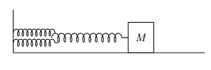
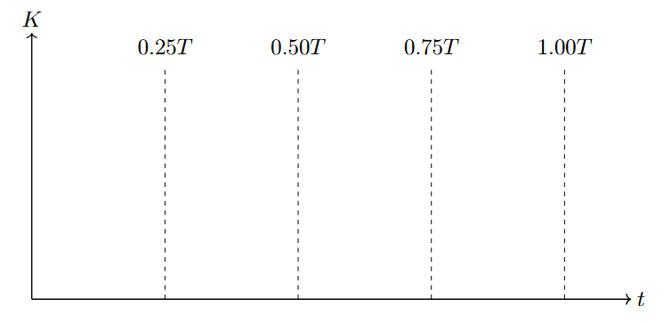
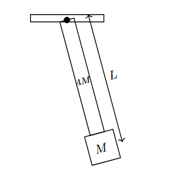

*Suggested Time: 20-25 minutes*

1.) A block of mass $M$ is attached to an assembly of three springs,
each with the same force constant $3k$. Two of the springs are connected
side-by-side, and are then both connected end-to-end to the third
spring. The block-spring system is pulled a small distance from
equilibrium, the block is first released from rest at $t = 0$, causing
the system to oscillates with period $T$. Friction between all surfaces
is negligible.

{width="4.964326334208224in"
height="1.6628083989501312in"}

a.)

i.) **Graph** the kinetic energy of the block-spring system as a
function of time on the interval $0 \leq t \leq T$, assuming the block
is first released from rest at $t = 0$

{width="7.159087926509186in"
height="3.441868985126859in"}

ii.) **Derive** an expression for the time after $t = 0$ when the block
first reaches its maximum speed. Answer in terms of $m,k,$ and physical
constants.

iii.) Suppose the value of each spring constant $k$ was doubled, giving
the system an oscillation period $T_{2k}$. **Calculate** the value of
the ratio $\frac{T_{2k}}{T}$, where $T$ is the original period.

b.) In another experiment, the block of mass $M$ is welded to a rigid
rod of length $L$ pivoted to the ceiling. The rod without the block
attached has a mass of $4M$ and a moment of inertia $I_{Rod}$ about the
pivot. The block has negligible size compared to the rod. The rod is
displaced an angle $\theta$ from the vertical, and begins to
swing.{width="2.9531255468066493in"
height="3.1706036745406823in"}

**Derive**, but do not solve, a differential equation that could yield
the angular displacement $\theta$ of the system as a function of time.
Do not assume $\theta$ is small.
