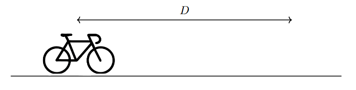

*Suggested Time: 15-20 minutes*

4.) A cyclist travels along the same bike route every day. The cyclist
first travels a distance $d$ directly East, then returns home by
traveling a distance $d$ directly West. Without wind, the cyclist
maintains a constant speed $v$ throughout their entire journey.

{width="6.057292213473316in"
height="1.5240299650043745in"}

On a day with wind to the East, their speed increases and decreases by a
constant value $w$ due to the wind's orientation relative to the
cyclist:

-   When biking to the East, the cyclist's speed is boosted by the wind,
    increasing to $v + w$

-   When biking to the West, the cyclist's speed is hindered by the
    wind, decreasing to $v - w$

a.) **Indicate** whether the cyclist's average speed on the windy day is
lower, higher, or the same as their average speed on a day without wind.
**Justify** your answer without manipulating equations.

b.) **Derive** an expression for the cyclist's overall average speed on
the windy day. Answer only in terms of the speeds $v$ and $w$.

c.) **Indicate** whether your expression derived in part (b.) is
consistent with your comparison in part (a.). **Justify** your answer.
