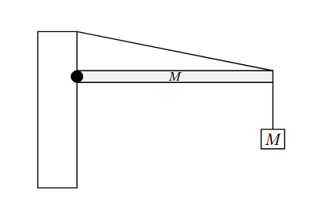
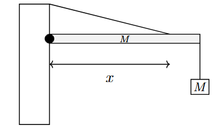
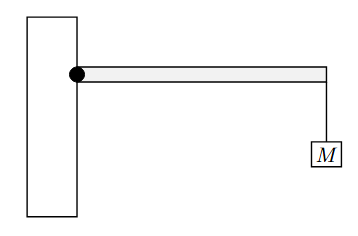

*Suggested Time: 15-20 minutes*

4.) A crate of mass $M$ is suspended from rest that the end of a
horizontal beam of mass $M$ and length $l$ pivoted against a wall. The
beam is in equilibrium, and is supported by a rope that attaches the end
of the beam to the wall as shown below.
{width="4.630208880139983in"
height="3.1229090113735785in"}

Suppose the rope is moved a small horizontal distance towards the center
of the beam.

{width="3.9739588801399823in"
height="2.3442869641294837in"}

a.) Let $F_{y}$ represent the vertical component of the supporting force
applied to the beam by the wall.

**Indicate** how the magnitude of $F_{y}$ will change when the cable is
moved towards the beam's center

> \_\_\_\_\_\_\_\_\_\_ The magnitude of $F_{y}$ will increase
>
> \_\_\_\_\_\_\_\_\_\_ The magnitude of $F_{y}$ will decrease
>
> \_\_\_\_\_\_\_\_\_\_ The magnitude of $F_{y}$ will stay constant

**Justify** your selection without manipulating equations

b.) Let $x$ represent the distance that the rope is attached from the
pivot point. **Derive** an expression for the magnitude of $F_{y}$ in
terms of $M,l,x$ and physical constants

c.) **Derive** an expression (in terms of $l$) for the position
$0 < x \leq l$ where the rope can be attached to the beam from the wall
in order to minimize the magnitude of $F_{y}$.

{width="4.098958880139983in"
height="2.693601268591426in"}
