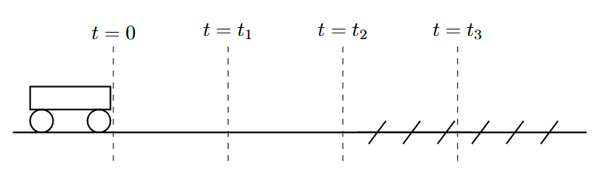
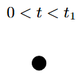
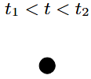
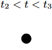
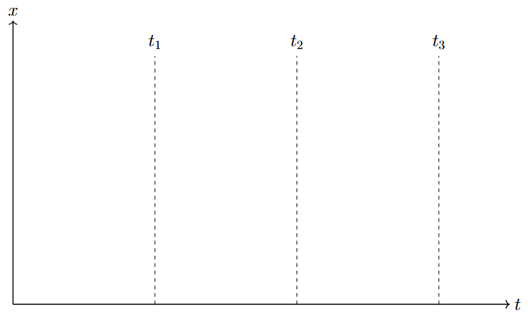

*Suggested Time: 25-30 minutes*

2.) A wound-up pullback car, initially at rest, undergoes the following
motion:

-   At $t = 0$, the pullback car is released from rest and begins to
    speed up at a constant rate

-   At $t = t_{1}$, the pullback car reaches a maximum constant speed
    $v_{Max}$

-   At $t = t_{2}$ the pullback car encounters a rough surface, and
    slows down according to the expression $v(t) = v_{Max} -$
    $(t - t_{2})^{2}$ on the interval $t_{2} \leq t \leq t_{3}$

-   At $t = t_{3}$, the pullback car comes to a stop

{width="7.29549978127734in"
height="2.1512368766404197in"}

a.) At each of the indicated times, **draw** the direction of the
acceleration $a$ of the pullback car on the dot at each of the indicated
times. If the acceleration of the car is zero, write "$a = 0$" below the
dot at that time.

{width="1.1770833333333333in"
height="1.1979166666666667in"}{width="1.2083333333333333in"
height="1.0416666666666667in"}{width="1.1354166666666667in"
height="1.09375in"}

b.) **Derive** an expression for the total distance $\Delta x$ traveled
by the car on the entire time interval in terms of
$v_{Max},t_{1},t_{2},$ and $t_{3}$. Begin your derivation by writing a
fundamental physics principle or an equation from the reference tables.

c.) **Sketch** a graph of the position $x$ of the car as a function of
time on the interval $\lbrack 0,t_{3}\rbrack$, given that the car starts
at an initial position of $x = 0$.

{width="6.5in"
height="4.055555555555555in"}

d.) **Indicate** whether the graph drawn in part (c.) is consistent with
the direction of the acceleration vectors drawn in part (a.). Briefly
**justify** your answer.
