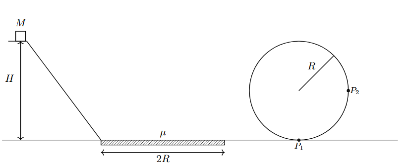
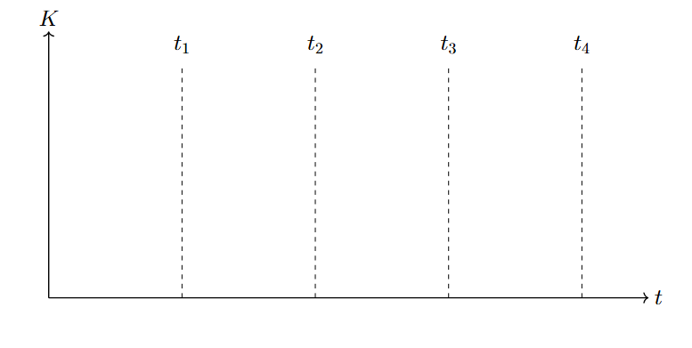

*Suggested Time: 25-30 minutes*

2.) A crate of mass $M$ undergoes the following motion:

-   First, the crate slides down a frictionless hill of height $H$,
    starting from rest.

-   After reaching the bottom of the hill, the crate slides across a
    rough horizontal surface of length $2R$ where the kinetic friction
    coefficient between the crate and the ground is $\mu$.

-   The crate then travels on a horizontal frictionless surface before
    moving around a vertical loop of radius $R$. Assume the crate is
    able to successfully remain in contact with the loop during the
    entirety of its motion.

{width="7.28125in"
height="2.933522528433946in"}

a.) Consider the following two points along the crate's motion through
the loop:

-   Point $P_{1}$, which is located at the bottom of the loop

-   Point $P_{2}$, which is located on the right side of the loop,
    halfway to the top of the loop

On the dots below, **draw** and label **arrows** that represent the
forces (not components) that are exerted on the crate at each of the
indicated positions on the diagram as the crate travels around the
circular loop. Each force in your diagram must be represented by a
distinct arrow starting on, and pointing away from, the dot. **Draw**
the relative lengths of all arrows to reflect the relative magnitudes of
all the forces.

> Point $P_{1}$ Point $P_{2}$

{width="2.78125in"
height="2.78125in"}{width="2.78125in"
height="2.78125in"}

b.) **Derive** an expression for the minimum height of the ramp
$H_{Min}$ necessary for the crate to successfully travel around the
circular loop without losing contact.

c.) Consider the following times:

-   At $t = 0$, the crate is released from rest at a height
    $H > H_{Min}$

-   At time $t = t_{1}$, the crate reaches the bottom of the ramp

-   At time $t = t_{2}$, the crate leaves the rough horizontal surface

-   At time $t = t_{3}$, the crate enters the circular loop

-   At time $t = t_{4}$ the crate returns to the bottom of the circular
    loop

On the axes below, **sketch** a graph of the crate's kinetic energy on
the interval
$0 \leq t \leq t_{4}${width="6.94248031496063in"
height="3.5038845144356956in"}

d.) Suppose the value of $\mu$ increased. **Indicate** how increasing
the value of $\mu$ would affect the value of $H_{Min}$ from part (b.),
and **indicate** one effect this change has on the graph in part (c.)
