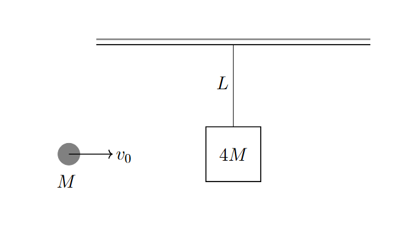
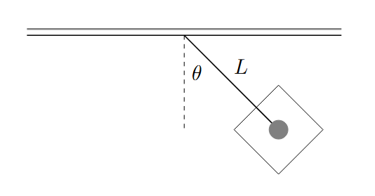
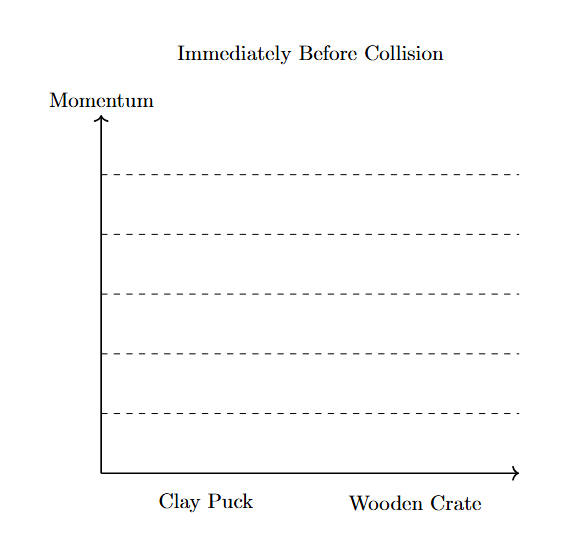
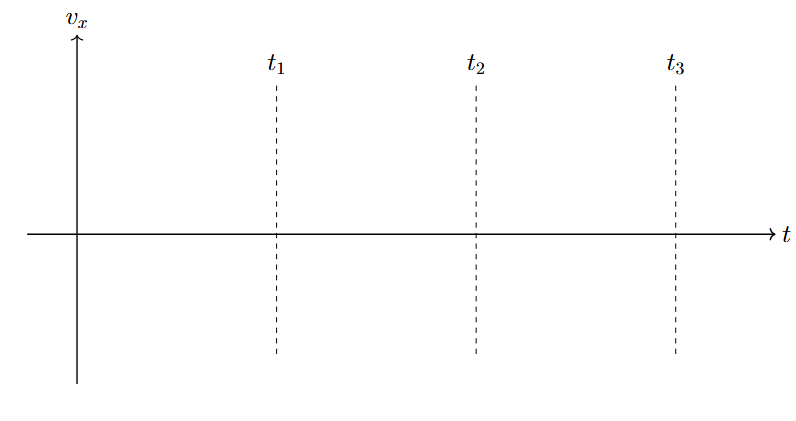

*Suggested Time: 25-30 minutes*

2.) A sticky clay puck of mass $M$ traveling at horizontal velocity
$v_{0}$ strikes the center of stationary crate of mass $4M$ attached to
the ceiling by a string of length $L$. The clay puck sticks to the
crate, and the entire system swings upwards until momentarily stopping
after the string makes an angle $\theta$ with the ceiling as shown in
the figure
below.{width="4.296875546806649in"
height="2.4238779527559053in"}

{width="3.443462379702537in"
height="1.7916174540682415in"}

\\

a.) **Draw** a set of quantitatively accurate bar graphs showing the
horizontal momentum of both objects immediately before and after the
collision. If the momentum of either object is zero at a specific time,
write $"0"$ instead of drawing a bar.
{width="3.9288702974628174in"
height="3.6869444444444444in"}

{width="3.9270833333333335in"
height="3.575262467191601in"}

b.) **Derive** an expression for the launch speed $v_{0}$ of the puck in
terms of $L,\theta$ and physical constants.

c.) **Sketch** a graph of the horizontal velocity of the puck as a
function of time given the following information:

-   At $t = 0$, the puck is first launched

-   At $t = t_{1}$ the puck collides with the crate

-   At $t = t_{2}$ the system reaches its maximum height

-   At $t = t_{3}$ the crate returns to its original position

{width="6.640625546806649in"
height="3.5178926071741032in"}

d.) Suppose this scenario was repeated with a thick rod of the same
length pivoted at the ceiling instead of a massless string. **Indicate**
one effect that this change would have on the graph drawn in part (c.).
Briefly **justify** your answer.
